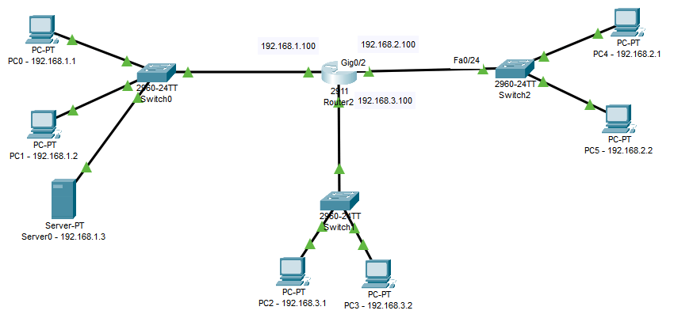

## EJERCICIO-1

Dada la siguiente topología de red realizar sobre la misma las actuaciones que se piden:


+ Cambiar el nombre del router a Router0

```
Router(config)#hostname Router0
```

+ Mostrar las interfaces del router

```
Router0#show ip interface brief
Interface              IP-Address      OK? Method Status                Protocol 
GigabitEthernet0/0/0   192.168.0.1     YES manual up                    up 
GigabitEthernet0/0/1   192.168.1.1     YES manual up                    up 
GigabitEthernet0/0/2   unassigned      YES unset  administratively down down 
Vlan1                  unassigned      YES unset  administratively down down
```

+ Asignar a la interfaz `GigabitEthernet 0/0/0` la ip `192.168.0.1`

```
Router(config)#interface gigabitEthernet 0/0/0
Router(config-if)#ip address 192.168.0.1 255.255.255.0
```

+ Asignar a la interfaz `GigabitEthernet 0/0/1` la ip `192.168.1.1`

```
Router(config)#interface gigabitEthernet 0/0/1
Router(config-if)#ip address 192.168.1.1 255.255.255.0
```

+ Crear una regla ***ACL estándar*** de forma que la red de los alumnos no pueda conectarse a la red de los profesores. Mostrar las reglas creadas

```
Router0(config)#access-list 11 deny 192.168.0.0 0.0.0.255
Router0(config)#access-list 11 permit any
Router0(config)#interface gigabitEthernet 0/0/1
Router0(config)#ip access-group 11 out
```

+ Borrar una regla ***ACL***

```
Router0(config)#no access-list 113
```

+ Liberar una interfaz de su regla ***ACL***

```
Router0(config)#no ip access-group 11 out
```

+ Crear una regla ***ACL estándar*** donde el equipo `192.168.0.2` no pueda acceder a la red de profesores.

```
Router0(config)#
```


## EJERCICIO-2

Dada la siguiente topología de red, crear una ***ACL extendida*** que impida el tráfico `HTTP` desde la red `192.168.2.0/24` a la red `192.168.1.0/24` y que permita el resto del tráfico.




```
Router1(config)#access-list 101 deny tcp 192.168.2.0 0.0.0.255 192.168.1.0 0.0.0.255 eq 80
Router1(config)#access-list 101 permit ip any any

Router1(config-if)#ip access-group 101 out
```


## EJERCICIO-3

Dada la siguiente topología de red en la que tenemos 2 oficinas con N equipos conectados en cada una de ellas ( en este caso hay 2 equipos ). En cada oficina hay un switch, y cada switch se conecta a un router central. Por último, tenemos una zona llamada servidores donde hay 3 servidores diferentes (servidor web, servidor ftp y una impresora):


El direccionamiento de red de cada uno de los equipos es el siguiente:


Crear una serie de reglas de acceso que permitirán el acceso entre una zona origen y una zona destino según la siguiente tabla:


>NOTA: Pega los comandos en cajas de código de forma limpia y ordenada

``
Router0#show ip access-list

Extended IP access list 100
10 permit tcp 192.168.0.0 0.0.0.255 host 192.168.2.3 eq 20
Extended IP access list 102
10 permit tcp host 192.168.1.2 host 192.168.2.3 range 20 ftp

``