1. Construye en Packet Tracer la topología que se pide.

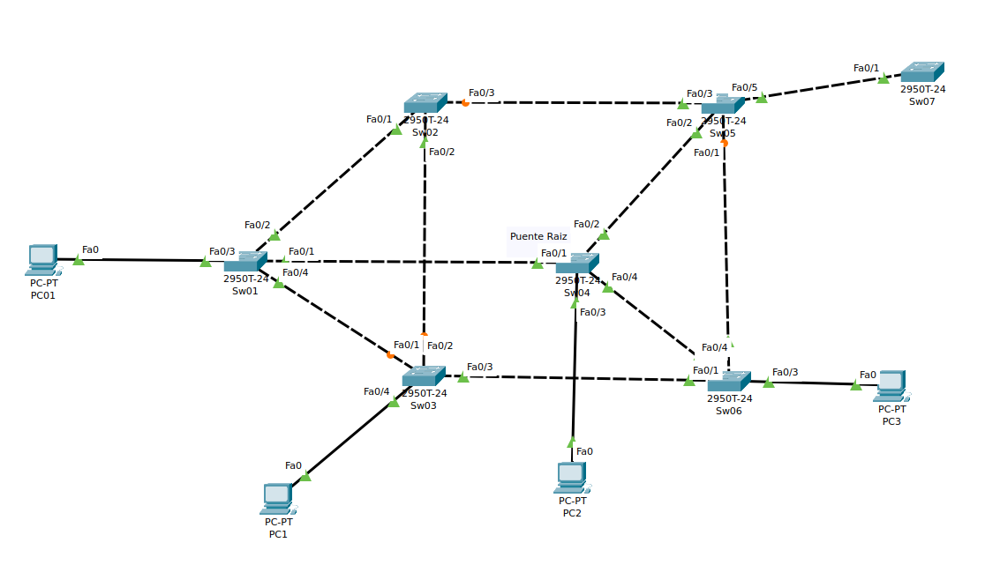

2. Realiza un ping desde el PC1 al resto de PC´s. Muestra la tabla ARP de cada uno para confirmar que hay comunicación entre todos los equipos.

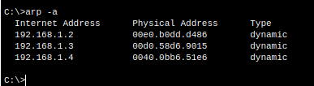

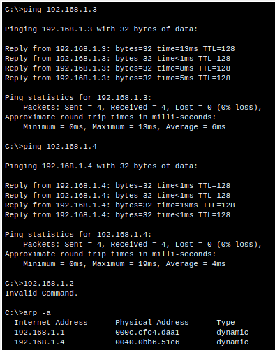

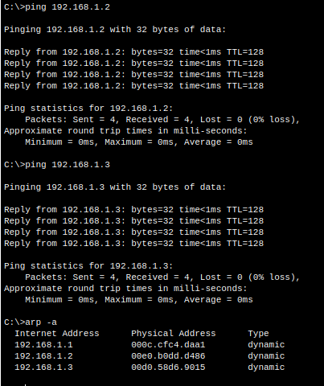

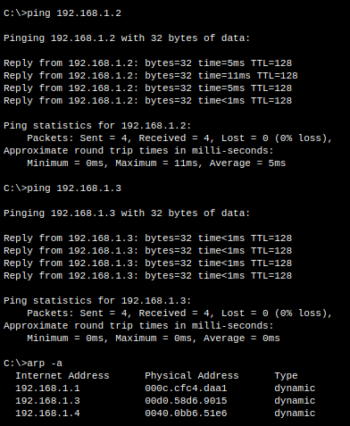

3. Comprueba en tres switches la información sobre: nodo o puente raíz, coste, prioridad y estado de sus puertos troncales (raíz, designados y no designados)

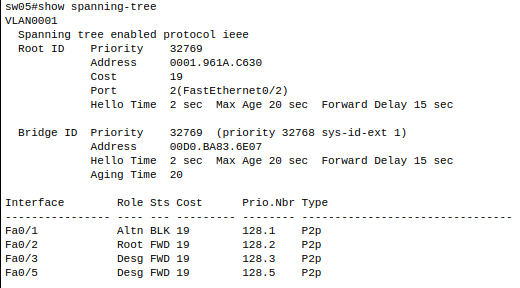

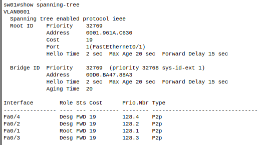

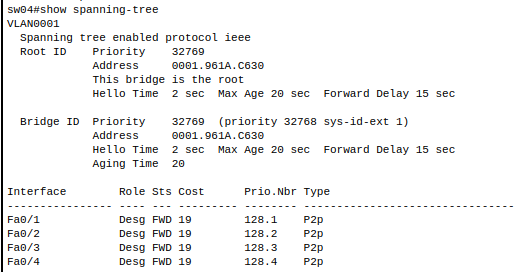

4. Lo que se suele hacer es fijar cuál de los conmutadores queremos fijar como puente raíz. El comando para fijar un nodo como raíz se utiliza para una VLAN en concreto (en nuestro caso lo vamos a hacer para la VLAN 1), y lo vamos a utilizar sobre un Switch  que no sea el actual nodo raíz de STP.

+ Inserta una captura de pantalla del puente raíz resultado del algoritmo STP:

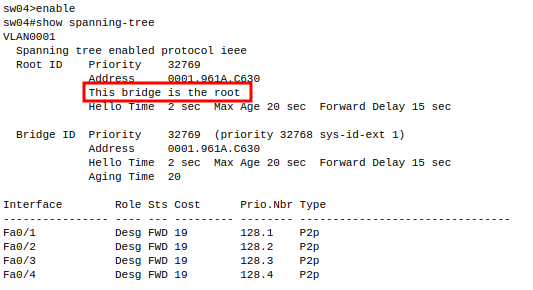

+ Cambia el puente raíz (a uno que no lo sea) ejecutando `spanning-tree vlan 1 root primary`, vuelve a mostrar la información del puente para verificar que es el puente raíz (`show spanning tree`):

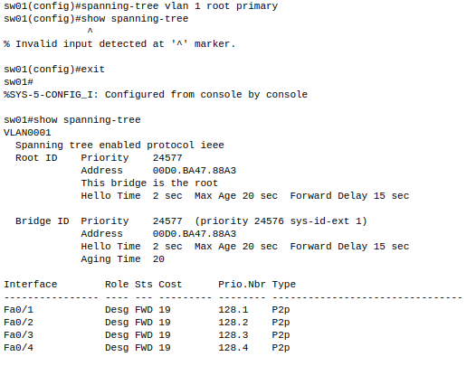

5. Para continuar la práctica, se pide que, eliminando cada una de las veces el cable de unión entre el Switch2 y el Swicth5, verificar como esta eliminación afecta, temporalmente, a las comunicaciones entre los equipos PC0 y PC1, PC0 y PC2 y PC0 y PC3. Para ello desde el PC0 ejecutamos `ping -t direccion_ip` (de esta forma se consigue que no se interrumpa el ping)

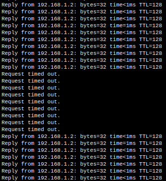

6. Al realiar el comando spanning-tree podemos ver el costo de las rutas. Este costo puede reducirse haciendo que la ruta cambie forzosamente.
Con el comando 'spanning-tree cos 8' podemos reducirlo, así que accedemos a uno de los routers y modificamos la Fa0/1.

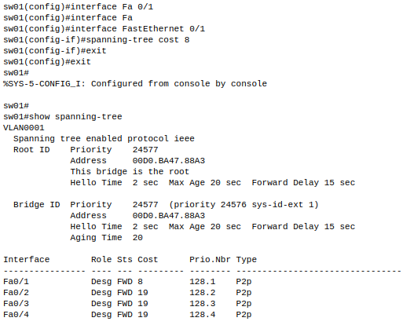

