## EJERCICIO1:

1.Diseño de la topología:

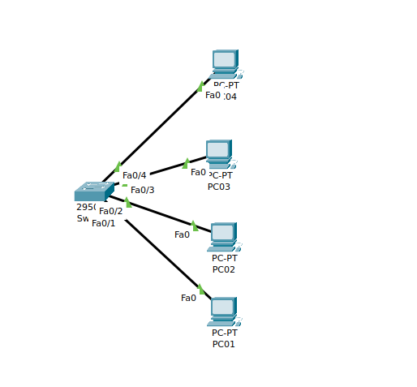

2. Extraer una nueva VLAN que será la nueva VLAN2, con el nombre pruebav2

Para mostrar la vlan ejecutamos este comando:

____

gael_hg#show vlan brief

VLAN Name                             Status    Ports
---- -------------------------------- --------- -------------------------------
1    default                          active    Fa0/1, Fa0/2, Fa0/3, Fa0/4
                                                Fa0/5, Fa0/6, Fa0/7, Fa0/8
                                                Fa0/9, Fa0/10, Fa0/11, Fa0/12
                                                Fa0/13, Fa0/14, Fa0/15, Fa0/16
                                                Fa0/17, Fa0/18, Fa0/19, Fa0/20
                                                Fa0/21, Fa0/22, Fa0/23, Fa0/24
1002 fddi-default                     active    
1003 token-ring-default               active    
1004 fddinet-default                  active    
1005 trnet-default                    active

____

Para insertar una nueva VLAN:

gael_hg#configure terminal 
Enter configuration commands, one per line.  End with CNTL/Z.
gael_hg(config)#vlan 2
gael_hg(config-vlan)#name PRUEBAV2
____

Comprobamos que se ha creado correctatmente que se ha creado correctamente la nueva VLAN: 
____

gael_hg#show vlan brief

VLAN Name                             Status    Ports
---- -------------------------------- --------- -------------------------------
1    default                          active    Fa0/1, Fa0/2, Fa0/3, Fa0/4
                                                Fa0/5, Fa0/6, Fa0/7, Fa0/8
                                                Fa0/9, Fa0/10, Fa0/11, Fa0/12
                                                Fa0/13, Fa0/14, Fa0/15, Fa0/16
                                                Fa0/17, Fa0/18, Fa0/19, Fa0/20
                                                Fa0/21, Fa0/22, Fa0/23, Fa0/24
2    PRUEBAV2                         active    
1002 fddi-default                     active    
1003 token-ring-default               active    
1004 fddinet-default                  active    
1005 trnet-default                    active
____

3. Realizar la siguiente configuración de redes VLAN:

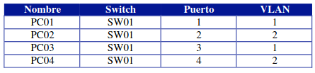

gael_hg(config)#interface fastEthernet 0/2
gael_hg(config-if)#switchport access vlan 2
gael_hg(config-if)#exit
gael_hg(config)#interface fastEthernet 0/4
gael_hg(config-if)#switchport access vlan 4


4. Realizar ping entre los diferentes equipos para comprobar que la configuración anterior funciona correctamente.

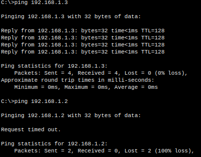

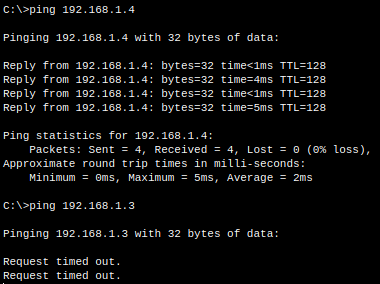


## EJERCICIO02

1. Relaizamos la siguiente topología de red:

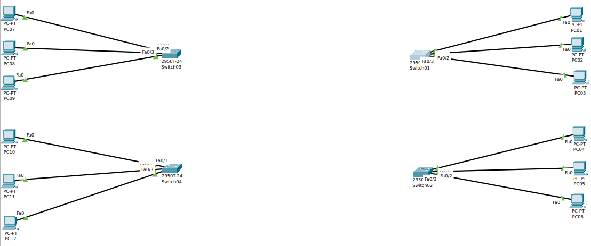

2. Insertar una nueva VLAN, que será la VLAN número 2, con el nombre PRUEBAV2; VLAN número 3, con el nombre PRUEBAV3.

SW01(config)#vlan 2
SW01(config-vlan)#name PRUEBAV2
SW01(config-vlan)#exit
SW01(config)#vlan 3
SW01(config-vlan)#name PRUEBAV3
____

SW01(config)#interface FastEthernet 0/3
SW01(config-if)#switchport access vlan 3
____

SW01#show vlan brief

VLAN Name                             Status    Ports
---- -------------------------------- --------- -------------------------------
1    default                          active    Fa0/1, Fa0/2, Fa0/3, Fa0/4
                                                Fa0/5, Fa0/6, Fa0/7, Fa0/8
                                                Fa0/9, Fa0/10, Fa0/11, Fa0/12
                                                Fa0/13, Fa0/14, Fa0/15, Fa0/16
                                                Fa0/17, Fa0/18, Fa0/19, Fa0/20
                                                Fa0/21, Fa0/22, Fa0/23, Fa0/24
                                                Gig0/1, Gig0/2
2    PRUEBAV2                         active    
3    PRUEBAV3                         active

4. Realizar la siguiente configuracion de redes VLAN:

Ejecutamos el codigo en cada switch siguiente solo en aquellas maquinas que se conecten a las VLAN2 y VLAN3:

5. Realizar ping entre los diferentes equipos para comprobar que la configuración
de cada equipo funciona correctamente.

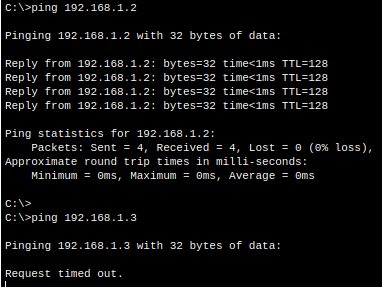

6. Unir los switchs de comunicaciones entre ellos siguiendo el siguiente esquema de conexiones:

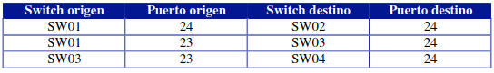

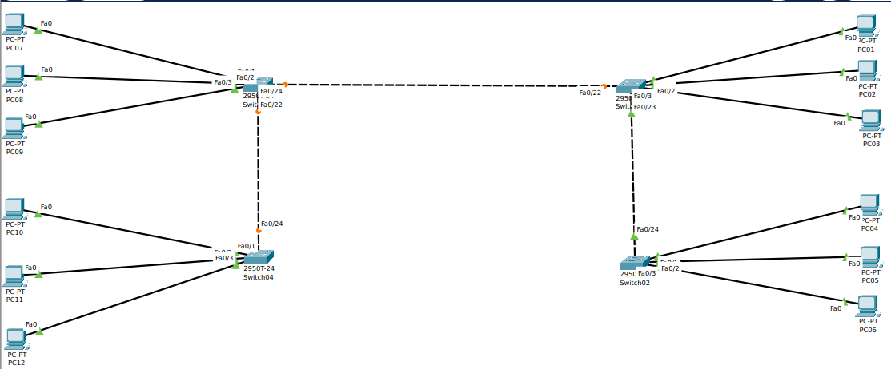

Para la VLAN1, nos encontramos que hay comunicación porque es la default:

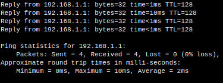

Comprobamos que para la VLAN2 no existe comunicacion porque no hay enlace trunck entre los switch.

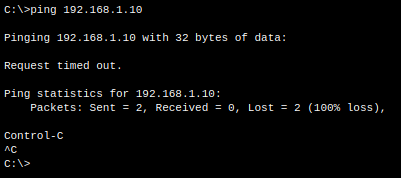

7. Colocar la siguiente configuracion de puertos TRUNCK:

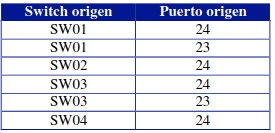


Para configurar un puerto como trunk en un switch en Packet Tracer mediante la CLI, puedes usar los siguientes comandos:

1.  Entra en modo de configuración global:


```
switch# configure terminal
```

2.  Configura el modo de puerto para el puerto específico que deseas usar como trunk:


```
switch(config)# interface interface_number
```

3.  Configura el modo de puerto para trunk:


```
switch(config-if)# switchport mode trunk
```

4.  Configura los protocolos de VLAN permitidos en el trunk (opcional):


```
switch(config-if)# switchport trunk allowed vlan vlan_list
```

5.  Verifica la configuración:


```
switch(config-if)# end
switch# show interfaces interface_number switchport
```

Nota: Reemplaza "interface\_number" y "vlan\_list" con los valores apropiados para tu entorno.

2 / 2