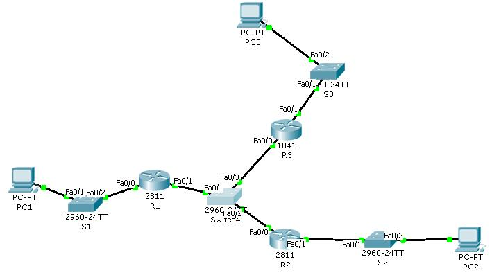
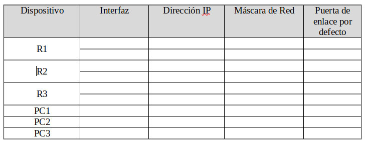

# Ejercicio 

Dado el esquema de red siguiente, montarlo en Packet Tracer, responder a las preguntas y subir la carpeta con todos los archivos al repositorio.



1. Rellena la siguiente tabla (debes quitar la imagen y poner la tabla en markdown, puedes usar este servicio https://www.tablesgenerator.com/):




2. Configura la dirección `IP` y la puerta de enlace para cada `PC`. 

+ PC1

```
FastEthernet0 Connection:(default port)

   Connection-specific DNS Suffix..: 
   Link-local IPv6 Address.........: FE80::290:21FF:FE7D:658
   IPv6 Address....................: ::
   IPv4 Address....................: 192.168.1.2
   Subnet Mask.....................: 255.255.255.0
   Default Gateway.................: ::
                                     192.168.1.1
```

+ PC2

```
FastEthernet0 Connection:(default port)

   Connection-specific DNS Suffix..: 
   Link-local IPv6 Address.........: FE80::2D0:97FF:FE3A:B05C
   IPv6 Address....................: ::
   IPv4 Address....................: 172.23.0.2
   Subnet Mask.....................: 255.255.0.0
   Default Gateway.................: ::
                                     172.23.0.1
```

+ PC3

```
FastEthernet0 Connection:(default port)

   Connection-specific DNS Suffix..: 
   Link-local IPv6 Address.........: FE80::2E0:B0FF:FE18:177D
   IPv6 Address....................: ::
   IPv4 Address....................: 172.19.0.2
   Subnet Mask.....................: 255.255.0.0
   Default Gateway.................: ::
                                     172.19.0.1

```

3. Configura el nombre de cada Router y de cada switch según el esquema.

Para los routers:

+ R1

```
Router>enable
Router#configure terminal 
Router(config)#hostname R1
R1(config)#
```

+ R2

```
Router>enable
Router#configure term
Router(config)#hostname R2
R2(config)#
```

+ R3

```
Router>enable
Router#configure terminal
Router(config)#hostname R3
R3(config)#
```
Para los switch:

+ S1

```
Switch>enable
Switch#configure terminal
Switch(config)#hostname S1
S1(config)#
```

+ S2

```
Switch>enable
Switch#configure terminal
Switch(config)#hostname S2
S2(config)#
```

+ S3

```
Switch>enable
Switch#configure terminal
Switch(config)#hostname S4
S4(config)#
```

+ S4

```
Switch>enable
Switch#configure terminal
Switch(config)#hostname S4
S4(config)#
```

4. Configura las direcciones `IP` de cada router.

+ R1

```
R1(config)#interface fastEthernet 0/0
R1(config-if)#ip address 192.168.1.1 255.255.255.0

R1(config-if)#no shutdown 

R1(config-if)#
%LINK-5-CHANGED: Interface FastEthernet0/0, changed state to up

%LINEPROTO-5-UPDOWN: Line protocol on Interface FastEthernet0/0, changed state to up
```
```
R1(config)#interface fastEthernet 0/1
R1(config-if)#ip address 10.0.0.1 255.255.255.0
R1(config-if)#no shutdown 

R1(config-if)#
%LINK-5-CHANGED: Interface FastEthernet0/1, changed state to up

%LINEPROTO-5-UPDOWN: Line protocol on Interface FastEthernet0/1, changed state to up
```

+ R2

```
R2(config)#interface fastEthernet 0/1
R2(config-if)#ip address 172.23.0.1 255.255.0.0
R2(config-if)#no shutdown 

R2(config-if)#
%LINK-5-CHANGED: Interface FastEthernet0/1, changed state to up

%LINEPROTO-5-UPDOWN: Line protocol on Interface FastEthernet0/1, changed state to up
```
```
R2(config)#interface fastEthernet 0/0
R2(config-if)#ip address 10.0.0.2 255.255.255.0
R2(config-if)#no shutdown 

R2(config-if)#
%LINK-5-CHANGED: Interface FastEthernet0/0, changed state to up

%LINEPROTO-5-UPDOWN: Line protocol on Interface FastEthernet0/0, changed state to up
```

+ R3

```
R3(config)#interface fastEthernet 0/1
R3(config-if)#ip address 172.19.0.1 255.255.0.0
R3(config-if)#no shutdown

R3(config-if)#
%LINK-5-CHANGED: Interface FastEthernet0/1, changed state to up

%LINEPROTO-5-UPDOWN: Line protocol on Interface FastEthernet0/1, changed state to up
```
```
R3(config)#interface fastEthernet 0/0
R3(config-if)#ip address 10.0.0.3 255.255.255.0
R3(config-if)#no shutdown 

R3(config-if)#
%LINK-5-CHANGED: Interface FastEthernet0/0, changed state to up

%LINEPROTO-5-UPDOWN: Line protocol on Interface FastEthernet0/0, changed state to up
```

5. Comprueba que has configurado las  direcciones `IP` bien. Para ello ejecuta el comando `show ip interface brief` en los tres Routers y cópialo en las siguientes cajas de código.

+ R1

```
R1#show ip interface brief
Interface              IP-Address      OK? Method Status                Protocol 
FastEthernet0/0        192.168.1.1     YES manual up                    up 
FastEthernet0/1        10.0.0.1        YES manual up                    up 
Vlan1                  unassigned      YES unset  administratively down down
```

+ R2

```
R2#show ip interface brief 
Interface              IP-Address      OK? Method Status                Protocol 
FastEthernet0/0        10.0.0.2        YES manual up                    up 
FastEthernet0/1        172.23.0.1      YES manual up                    up 
Vlan1                  unassigned      YES unset  administratively down down
```

+ R3

```
R3#show ip interface brief 
Interface              IP-Address      OK? Method Status                Protocol 
FastEthernet0/0        10.0.0.3        YES manual up                    up 
FastEthernet0/1        172.19.0.1      YES manual up                    up 
Vlan1                  unassigned      YES unset  administratively down down
```
6. Comprueba la tabla de encaminamiento en cada Router y muéstralo en las siguientes cajas de código:

+ R1

```
R1#show arp
Protocol  Address          Age (min)  Hardware Addr   Type   Interface
Internet  10.0.0.1                -   0001.9611.DE02  ARPA   FastEthernet0/1
Internet  192.168.1.1             -   0001.9611.DE01  ARPA   FastEthernet0/0
```

+ R2

```
R2#show arp
Protocol  Address          Age (min)  Hardware Addr   Type   Interface
Internet  10.0.0.2                -   000D.BDA8.E901  ARPA   FastEthernet0/0
Internet  172.23.0.1              -   000D.BDA8.E902  ARPA   FastEthernet0/1
```

+ R3

```
R3#show arp
Protocol  Address          Age (min)  Hardware Addr   Type   Interface
Internet  10.0.0.3                -   0010.1115.2401  ARPA   FastEthernet0/0
Internet  172.19.0.1              -   0010.1115.2402  ARPA   FastEthernet0/1
```

7. Prueba a hacer un ping desde el `R1` a `PC1`, desde `R2` a `PC2` y desde `R3` a `PC3`. Muestra el resultado en la siguiente caja de código:

+ R1-> PC1

```
R1#ping 192.168.1.2

Type escape sequence to abort.
Sending 5, 100-byte ICMP Echos to 192.168.1.2, timeout is 2 seconds:
.!!!!
Success rate is 80 percent (4/5), round-trip min/avg/max = 0/0/0 ms
```

+ R2-> PC2

```
R2#ping 172.23.0.2

Type escape sequence to abort.
Sending 5, 100-byte ICMP Echos to 172.23.0.2, timeout is 2 seconds:
.!!!!
Success rate is 80 percent (4/5), round-trip min/avg/max = 0/0/0 ms
```

+ R3-> PC3

```
R3#ping 172.19.0.2

Type escape sequence to abort.
Sending 5, 100-byte ICMP Echos to 172.19.0.2, timeout is 2 seconds:
.!!!!
Success rate is 80 percent (4/5), round-trip min/avg/max = 0/0/1 ms
```
8. Prueba a hacer ping desde el `PC1` al `PC2`, desde el `PC2` al `PC3`. ¿Porqué no funciona? Escribe una breve descripción de porque no funciona.

+ PC1-> PC2

```
C:\>ping 172.23.0.2

Pinging 172.23.0.2 with 32 bytes of data:

Reply from 192.168.1.1: Destination host unreachable.
Reply from 192.168.1.1: Destination host unreachable.
Reply from 192.168.1.1: Destination host unreachable.
Reply from 192.168.1.1: Destination host unreachable.

Ping statistics for 172.23.0.2:
    Packets: Sent = 4, Received = 0, Lost = 4 (100% loss),
```

+ PC2-> PC3

```
C:\>ping 172.19.0.2

Pinging 172.19.0.2 with 32 bytes of data:

Reply from 172.23.0.1: Destination host unreachable.
Reply from 172.23.0.1: Destination host unreachable.
Reply from 172.23.0.1: Destination host unreachable.
Reply from 172.23.0.1: Destination host unreachable.

Ping statistics for 172.19.0.2:
    Packets: Sent = 4, Received = 0, Lost = 4 (100% loss),
```

```
No funciona porque no hemos establecido la tabla de enrutamiento entre las redes.
```

9. Copia los comandos que han permitido que funcione.

```
R1(config)#ip route 172.19.0.0 255.255.0.0 10.0.0.3
R1(config)#ip route 172.23.0.0 255.255.0.0 10.0.0.2
```
```
R2(config)#ip route 192.168.1.0 255.255.255.0 10.0.0.1
R2(config)#ip route 172.19.0.0 255.255.0.0 10.0.0.3
```
```
R3(config)#ip route 192.168.1.0 255.255.255.0 10.0.0.1
R3(config)#ip route 172.23.0.0 255.255.0.0 10.0.0.2
```
10. Muestra el resultado de las tablas de encaminamiento de los tres routers:

+ R1

```
R1#show ip route 

     10.0.0.0/8 is variably subnetted, 2 subnets, 2 masks
C       10.0.0.0/24 is directly connected, FastEthernet0/1
L       10.0.0.1/32 is directly connected, FastEthernet0/1
S    172.19.0.0/16 [1/0] via 10.0.0.3
S    172.23.0.0/16 [1/0] via 10.0.0.2
     192.168.1.0/24 is variably subnetted, 2 subnets, 2 masks
C       192.168.1.0/24 is directly connected, FastEthernet0/0
L       192.168.1.1/32 is directly connected, FastEthernet0/0
```

+ R2

```
R2#show ip route 

     10.0.0.0/8 is variably subnetted, 2 subnets, 2 masks
C       10.0.0.0/24 is directly connected, FastEthernet0/0
L       10.0.0.2/32 is directly connected, FastEthernet0/0
S    172.19.0.0/16 [1/0] via 10.0.0.3
     172.23.0.0/16 is variably subnetted, 2 subnets, 2 masks
C       172.23.0.0/16 is directly connected, FastEthernet0/1
L       172.23.0.1/32 is directly connected, FastEthernet0/1
S    192.168.1.0/24 [1/0] via 10.0.0.1
```

+ R3

```
R3#show ip route

     10.0.0.0/24 is subnetted, 1 subnets
C       10.0.0.0 is directly connected, FastEthernet0/0
C    172.19.0.0/16 is directly connected, FastEthernet0/1
S    172.23.0.0/16 [1/0] via 10.0.0.2
S    192.168.1.0/24 [1/0] via 10.0.0.1
```