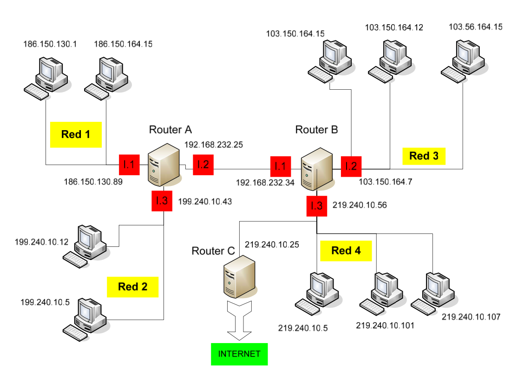
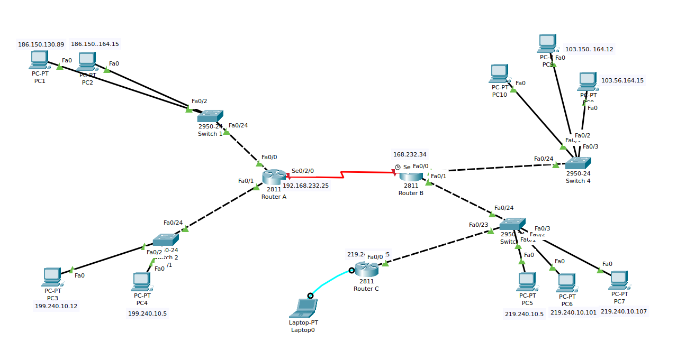

# EJERCICIO DE TABLAS DE ENCAMINAMIENTO

Dado el siguiente esquema:



1. Rellena las tablas de encaminamiento del `Router A`, `Router B` y `Router C` (usa las tablas que te suministra el profesor):

+ Router A
 
```
| DIRECCION DE RED | MASCARA       | ENCAMINADOR     | INTERFAZ | METRICA |
|------------------|---------------|-----------------|----------|---------|
| 186.150.0.0      | 255.255.0.0   | 0.0.0.0         | L.1      | 0       |
| 199.240.10.0     | 255.255.255.0 | 0.0.0.0         | L.3      | 0       |
| 192.168.232.0    | 255.255.255.0 | 0.0.0.0         | L.2      | 0       |
| 103.0.0.0        | 255.0.0.0     | 192.168.232.34  | L.2      | 1       |
| 219.240.10.0     | 255.255.255.0 | 192.168.232.34  | L.2      | 1       |
| 0.0.0.0          | 0.0.0.0       | 192.168.232..34 | L.2      | 1       |
```


+ Router B

```
| DIRECCION DE RED | MASCARA       | ENCAMINADOR    | INTERFAZ | METRICA |
|------------------|---------------|----------------|----------|---------|
| 186.150.0.0      | 255.255.0.0   | 192.168.232.25 | L.1      | 1       |
| 199.240.10.0     | 255.255.255.0 | 192.168.232.25 | L.1      | 1       |
| 192.168.232.0    | 255.255.255.0 | 0.0.0.0        | L.1      | 0       |
| 103.0.0.0        | 255.0.0.0     | 0.0.0.0        | L.2      | 0       |
| 219.240.10.0     | 255.255.255.0 | 0.0.0.0        | L.3      | 0       |
| 0.0.0.0          | 0.0.0.0       | 192.168.232.25 | L.1      | 1       |
```

+ Router C

```
| DIRECCION DE RED | MASCARA       | ENCAMINADOR    | INTERFAZ | METRICA |
|------------------|---------------|----------------|----------|---------|
| 186.150.0.0      | 255.255.0.0   | 219.240.10.56  | L.1      | 2       |
| 199.240.10.0     | 255.255.255.0 | 219.240.10.56  | L.1      | 2       |
| 192.168.232.0    | 255.255.255.0 | 219.240.10.56  | L.1      | 1       |
| 103.0.0.0        | 255.0.0.0     | 219.240.10.56  | L.1      | 0       |
| 219.240.10.0     | 255.255.255.0 | 0.0.0.0        | L.1      | 0       |
| 0.0.0.0          | 0.0.0.0       | 192.168.232.25 | L.1      | 1       |
```

2. Realiza en Packet Tracer el diagrama de red tal y como el que se adjunta. Debes poner las direcciones ip que se indican así como los carteles. Configura en cada `PC` los parámetros de la red que le corresponden. Pon una imagen del resultado de tu montaje.




3. Establece el nombre de cada uno de los routers:

+ Router A

```
Router(config)#hostname R1
R1(config)#
```

+ Router B

```
Router(config)#hostname R2
R2(config)#
```

+ Router C

```
Router(config)#hostname R3
R3(config)#
```

4. Configura el mensaje de bienvenida a cada uno de los routers `ROUTER A NOMBRE_ALUMNO`:

+ Router A

```
R1(config)#banner motd #Gael#
```

+ Router B

```
R2(config)#banner motd #Gael#
```

+ Router C

```
R3(config)#banner motd #Gael#
```


5. Establece para cada router la contraseña `cisco2223` para el acceso a la configuración:

+ Router A

```
R1(config)#line console 0
R1(config-line)#password cisco2223
```

+ Router B

```
R3(config)#line console 0
R3(config-line)#password cisco2223
```

+ Router C

```
R3(config)#line console 0
R3(config-line)#password cisco2223
```

6. Configura las direcciones `IP` de cada una de las interfaces de los routers:

+ Router A

```
R1(config)#interface FastEthernet0/0
R1(config-if)#ip address 186.150.130.89 255.255.0.0

R1(config)#interface FastEthernet0/1
R1(config-if)#ip address 199.240.10.43 255.255.255.0
```

+ Router B

```
R2(config)#interface FastEthernet0/0
R2(config-if)#ip address 103.150.164.7 255.0.0.0

R2(config)#interface FastEthernet0/1
R2(config-if)#ip address 219.240.10.56 255.255.255.0
```

+ Router C

```
R3(config)#interface FastEthernet0/0
R3(config-if)#ip address 219.240.10.25 255.255.255.0
```

7. Muestra un resumen de la configuración de las interfaces de cada router:

+ Router A

```
R1#show ip interface brief
Interface              IP-Address      OK? Method Status                Protocol 
FastEthernet0/0        186.150.130.89  YES manual up                    up 
FastEthernet0/1        199.240.10.43   YES manual up                    up 
Serial0/2/0            unassigned      YES unset  administratively down down 
Vlan1                  unassigned      YES unset  administratively down down
```

+ Router B

```
R2#show ip interface brief
Interface              IP-Address      OK? Method Status                Protocol 
FastEthernet0/0        103.150.164.7   YES manual up                    up 
FastEthernet0/1        219.240.10.56   YES manual up                    up 
Serial0/0/0            unassigned      YES unset  administratively down down 
Serial0/0/1            unassigned      YES unset  administratively down down 
Vlan1                  unassigned      YES unset  administratively down down
```

+ Router C

```
R3#show ip interface brief
Interface              IP-Address      OK? Method Status                Protocol 
FastEthernet0/0        219.240.10.25   YES manual up                    up 
FastEthernet0/1        unassigned      YES unset  administratively down down 
Serial0/2/0            unassigned      YES unset  administratively down down 
Vlan1                  unassigned      YES unset  administratively down down
```


8. Configura en cada router las rutas estáticas en base las tablas que has rellenado en el apartado 1:

+ Router A

```

```

+ Router B

```

```

+ Router C

```

```

9. Muestra la tabla de enrutamiendo de cada router:

+ Router A

```
R1#show ip route
Codes: L - local, C - connected, S - static, R - RIP, M - mobile, B - BGP
       D - EIGRP, EX - EIGRP external, O - OSPF, IA - OSPF inter area
       N1 - OSPF NSSA external type 1, N2 - OSPF NSSA external type 2
       E1 - OSPF external type 1, E2 - OSPF external type 2, E - EGP
       i - IS-IS, L1 - IS-IS level-1, L2 - IS-IS level-2, ia - IS-IS inter area
       * - candidate default, U - per-user static route, o - ODR
       P - periodic downloaded static route

Gateway of last resort is not set

     186.150.0.0/16 is variably subnetted, 2 subnets, 2 masks
C       186.150.0.0/16 is directly connected, FastEthernet0/0
L       186.150.130.89/32 is directly connected, FastEthernet0/0
     199.240.10.0/24 is variably subnetted, 2 subnets, 2 masks
C       199.240.10.0/24 is directly connected, FastEthernet0/1
L       199.240.10.43/32 is directly connected, FastEthernet0/1
```

+ Router B

```
R2#show ip route
Codes: L - local, C - connected, S - static, R - RIP, M - mobile, B - BGP
       D - EIGRP, EX - EIGRP external, O - OSPF, IA - OSPF inter area
       N1 - OSPF NSSA external type 1, N2 - OSPF NSSA external type 2
       E1 - OSPF external type 1, E2 - OSPF external type 2, E - EGP
       i - IS-IS, L1 - IS-IS level-1, L2 - IS-IS level-2, ia - IS-IS inter area
       * - candidate default, U - per-user static route, o - ODR
       P - periodic downloaded static route

Gateway of last resort is not set

     103.0.0.0/8 is variably subnetted, 2 subnets, 2 masks
C       103.0.0.0/8 is directly connected, FastEthernet0/0
L       103.150.164.7/32 is directly connected, FastEthernet0/0
     219.240.10.0/24 is variably subnetted, 2 subnets, 2 masks
C       219.240.10.0/24 is directly connected, FastEthernet0/1
L       219.240.10.56/32 is directly connected, FastEthernet0/1
```

+ Router C

```
R3#show ip route
Codes: L - local, C - connected, S - static, R - RIP, M - mobile, B - BGP
       D - EIGRP, EX - EIGRP external, O - OSPF, IA - OSPF inter area
       N1 - OSPF NSSA external type 1, N2 - OSPF NSSA external type 2
       E1 - OSPF external type 1, E2 - OSPF external type 2, E - EGP
       i - IS-IS, L1 - IS-IS level-1, L2 - IS-IS level-2, ia - IS-IS inter area
       * - candidate default, U - per-user static route, o - ODR
       P - periodic downloaded static route

Gateway of last resort is not set

     219.240.10.0/24 is variably subnetted, 2 subnets, 2 masks
C       219.240.10.0/24 is directly connected, FastEthernet0/0
L       219.240.10.25/32 is directly connected, FastEthernet0/0
```

10. Antes de hacer `ping` entre hosts muestra la tabla `arp` de los routers y de un `PC` de cada red:

+ Router A

```
R1#show arp
Protocol  Address          Age (min)  Hardware Addr   Type   Interface
Internet  186.150.130.1           17  0090.21CC.9955  ARPA   FastEthernet0/0
Internet  186.150.130.89          -   000A.4127.CD01  ARPA   FastEthernet0/0
Internet  186.150.164.15          2   0060.7041.DC59  ARPA   FastEthernet0/0
Internet  199.240.10.43           -   000A.4127.CD02  ARPA   FastEthernet0/1
```

+ Router B

```
R2#show arp
Protocol  Address          Age (min)  Hardware Addr   Type   Interface
Internet  103.150.164.7           -   0001.4256.C001  ARPA   FastEthernet0/0
Internet  219.240.10.56           -   0001.4256.C002  ARPA   FastEthernet0/1
```

+ Router C

```
R3#show arp
Protocol  Address          Age (min)  Hardware Addr   Type   Interface
Internet  219.240.10.25           -   000A.F316.B101  ARPA   FastEthernet0/0
```

+ PC de la RED 1

```

``` 

+ PC de la RED 2

```

``` 

+ PC de la RED 3

```

``` 


11. Realiza un un ping entre un PC de cada una de las redes con otro para comprobar la conectividad:

+ RED 1 -> RED 2

```

``` 

+ RED 1 -> RED 3

```

``` 

+ RED 1 -> RED 4

```

``` 

+ RED 2 -> RED 1

```

``` 

+ RED 2 -> RED 3

```

``` 

+ RED 2 -> RED 4

```

``` 

+ RED 3 -> RED 1

```

``` 

+ RED 3 -> RED 2

```

``` 

+ RED 3 -> RED 4

```

``` 

+ RED 4 -> RED 1

```

``` 

+ RED 4 -> RED 2

```

``` 

+ RED 4 -> RED 3

```

``` 

12. Vuelve a  mostrar la tabla `arp` de los routers y de un `PC` de cada red:

+ Router A

```

```

+ Router B

```

```

+ Router C

```

```

+ PC de la RED 1

```

``` 

+ PC de la RED 2

```

``` 

+ PC de la RED 3

```

``` 

13. Salva la configuración de cada uno de los routers:

+ Router A

```
R1#copy running-config startup-config 
Destination filename [startup-config]? 
Building configuration...
[OK]
```

+ Router B

```
R2#copy running-config startup-config 
Destination filename [startup-config]? 
Building configuration...
[OK]
```

+ Router C

```
R3#copy running-config startup-config 
Destination filename [startup-config]? 
Building configuration...
[OK]
```
