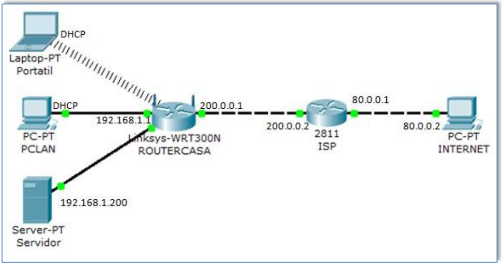

# SIMULACIÓN DE UN ENTORNO DOMÉSTICO

Vamos a simular la configuración de red que tenemos en casa. En primer lugar, montaremos la siguiente configuración:

Destacar de la configuración los siguientes elementos:

+ Portatil: equipo al que debemos cambiar su tarjeta de conexión de red para que se conecte mediante red inalámbrica. Su configuración IP la va a obtener del ROUTERCASA mediante DHCP.
+ PCLAN: su configuración IP la va a obtener del ROUTERCASA mediante DHCP.
+ Servidor: al tratarse de un equipo servidor de nuestra red LAN, o que va a ofertar servicios de red a la LAN, le colocaremos una dirección IP fija: 192.168.1.200.
+ ROUTERCASA: vamos a tratar esta comunicación como si fuera un router que utilizamos para dar servicio en casa. Si fuera la situación real, obtendría la dirección IP pública del router ISP, pero, por sencillez del esquema vamos a darle una IP pública estática: 200.0.0.1. Además, colocaremos como dirección IP de la LAN la 192.168.1.1.
+ ISP: le colocaremos las direcciones mostradas en el esquema.
+ INTERNET: pc que nos va a servir para intentar conectarnos a nuestra LAN o ser receptor de los `ping` de nuestros equipos LAN

En primer lugar, vamos a configurar nuestro ROUTERCASA. Lo primero, sus direcciones IP y su DHCP:

Recordar que, al colocar la configuración, y para que esta sea efectiva, debemos pulsar el botón al final de la imagen de Save Settings.
Con esta configuración, el PCLAN ya debe coger Configuración TCP/IP mediante DHCP. 

En segundo lugar, configuramos la inalámbrica. Cambiamos el SSID de la misma a micasa y deshabilitamos la propagación del SSID. Recordar grabar.

Establecemos como seguridad WPA2 Personal con TKIP como algoritmo, y la contraseña será AAFFAAFFAA (10 dígitos hexadecimales).

Recordar grabar (save settings)

Ahora, debemos cambiar la configuración del Portátil para poder entrar en esa inalámbrica.
Antes de nada, hay que cambiar la tarjeta de red Ethernet por una inalámbrica (PT-LAPTO-NM-1w, por ejemplo)

+ En primer lugar, entraremos en la interface Wireless y le asignaremos el mismo SSID que al
router (micasa).
+ Después elegiremos autenticación WPA2-PSK, colocaremos la clave de acceso y seleccionamos como algoritmo de encriptación TKIP.

Con estas actuaciones, ya conseguimos configurar la inalámbrica con encriptación.
Podemos comprobar que funciona ya que se debe producir la asignación de configuración IP mediante DHCP.