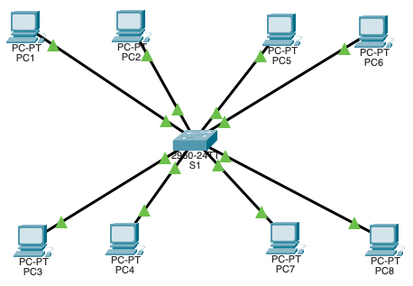
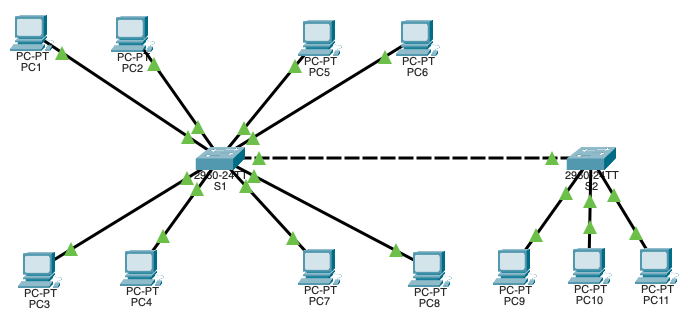
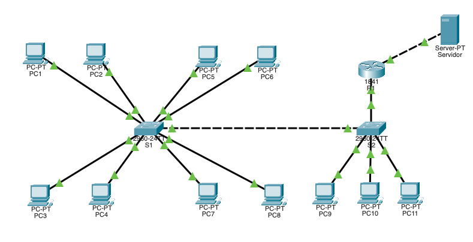

# PRACTICANDO CONFIGURACIONES DE VLAN

### EJERCICIO-1

1. Cambia el nombre del switch a **S1**.

~~~
Switch(config)#hostname SW1
~~~

2. Creamos las VLAN y le asignamos un nombre a cada siguiendo el criterio:

+ vlan 10 -> **proyecto10**

~~~
SW1(config)#vlan 10
SW1(config-vlan)#name proyecto10
~~~

+ vlan 20 -> **proyecto20**

~~~
SW1(config)#vlan 20
SW1(config-vlan)#name proyecto20
~~~

+ vlan 30 -> **proyecto30**

~~~
SW1(config)#vlan 30
SW1(config-vlan)#name proyecto30
~~~

3. Asignamos las máquinas a cada una de las vlan creadas siguiendo el criterio siguiente:

+ PC1, PC5 y PC8 forman el equipo de trabajo para el desarrollo del **proyecto10**

~~~
SW1(config)#interface range fa0/1-3
SW1(config-if-range)#switchport mode access
SW1(config-if-range)#switchport access vlan 10
~~~

+ PC2 y PC6 forman el grupo de trabajo para el desarrollo del **proyecto20**

~~~
SW1(config)#interface range fa0/4-5
SW1(config-if-range)#switchport mode access
SW1(config-if-range)#switchport access vlan 20
~~~

+ PC3, PC4 y PC7 forman el grupo de trabajo para el desarrollo del **proyecto30**

~~~
SW1(config)#interface range fa0/6-8
SW1(config-if-range)#switchport mode access
SW1(config-if-range)#switchport access vlan 30
~~~
4. Muestra  un resumen de las redes vlan creadas:

~~~
SW1#show vlan 

VLAN Name                             Status    Ports
---- -------------------------------- --------- -------------------------------
1    default                          active    Fa0/9, Fa0/10, Fa0/11, Fa0/12
                                                Fa0/13, Fa0/14, Fa0/15, Fa0/16
                                                Fa0/17, Fa0/18, Fa0/19, Fa0/21
                                                Fa0/22, Fa0/23, Fa0/24
10   proyecto10                       active    Fa0/1, Fa0/2, Fa0/3, Fa0/20
20   proyecto20                       active    Fa0/4, Fa0/5
30   proyecto30                       active    Fa0/6, Fa0/7, Fa0/8
1002 fddi-default                     active    
1003 token-ring-default               active    
1004 fddinet-default                  active    
1005 trnet-default                    active 
~~~

5. Configuramos las direcciones `ip`de cada uno de los equipos siguiendo el siguiente criterio:

+ Vlan 10 -> proyecto10 -> 10.0.10.0/24
+ Vlan 20 -> proyecto20 -> 10.0.20.0/24
+ Vlan 30 -> proyecto30 -> 10.0.30.0/24

Una vez hecho esto comprobar que sólo hay comunicación entre los distintos equipos que forman parte de la misma red `VLAN`.

### EJERCICIO-2

Partiendo del ejercicio de un switch ya resuelto, añadir un switch S2 conectado a S1. Este switch tendrá:

+ En el puerto 9 el equipo `PC9` del **proyecto10**.
+ En el puerto 10 el equipo `PC10` del **proyecto20**.
+ En el puerto 11 el equipo `PC11` del **proyecto30**.
+ El troncal estará en el primer puerto gigabitethernet de los dos switches

>***NOTA-1***: Conectamos los equipos al switch y les asignamos a cada uno de ellos las `ip`correspondientes **PERO NO CONFIGURAMOS NINGUNA VLAN EN EL SEGUNDO SWTICH**, ya que vamos a hacer uso del protocolo **VTP** para que el primer switch se comporte como **servidor** y el segundo como **cliente**

>***NOTA-2***: no conectar los dos switches entre sí hasta no configurar el **VTP**

1. Configura el switch S1 como **servidor** dentro del protocolo **VTP**

~~~

SW1(config)#VTP domain Gael
Changing VTP domain name from NULL to Gael
~~~

2. Muestra el estado del protocolo **VTP** en el switch S1

~~~
SW1#show VTP status 
VTP Version                     : 1
Configuration Revision          : 0
Maximum VLANs supported locally : 255
Number of existing VLANs        : 8
VTP Operating Mode              : Server
VTP Domain Name                 : Gael
VTP Pruning Mode                : Disabled
VTP V2 Mode                     : Disabled
VTP Traps Generation            : Disabled
MD5 digest                      : 0xD2 0xDB 0xC6 0x2B 0x03 0x0D 0x51 0x3D 
Configuration last modified by 0.0.0.0 at 3-1-93 00:12:00
Local updater ID is 0.0.0.0 (no valid interface found)
~~~

3. Conficura el puerto `Gig0/1` en modo **troncal**

~~~
SW1(config)#interface fastEthernet 0/24
SW1(config-if)#switchport mode trunk
~~~

4. Configura el switch S2 como **cliente** dentro del protocolo **VTP**

~~~
SW2(config)#Vtp domain Gael
Changing VTP domain name from NULL to Gael
SW2(config)#vtp mode client 
Setting device to VTP CLIENT mode.
~~~

5. Muestra el estado del protocolo **VTP** en el switch S2

~~~
SW2#show vtp status 
VTP Version                     : 1
Configuration Revision          : 0
Maximum VLANs supported locally : 255
Number of existing VLANs        : 5
VTP Operating Mode              : Client
VTP Domain Name                 : Gael
VTP Pruning Mode                : Disabled
VTP V2 Mode                     : Disabled
VTP Traps Generation            : Disabled
MD5 digest                      : 0x50 0xA1 0x07 0x14 0x61 0xAA 0x91 0xA7 
Configuration last modified by 0.0.0.0 at 0-0-00 00:00:00
~~~

6. Configura el puerto `Gig0/1` del switch S2 en modo **troncal**

~~~
SW2(config)#interface fastEthernet 0/24
SW2(config-if)#switchport mode trunk 
~~~

7. Muestra un resumen de las redes `VLAN` del switch S2 (no debe haber ninguna `VLAN` salvo la que se crea por defecto)

~~~
SW2#show vlan

VLAN Name                             Status    Ports
---- -------------------------------- --------- -------------------------------
1    default                          active    Fa0/1, Fa0/2, Fa0/3, Fa0/4
                                                Fa0/5, Fa0/6, Fa0/7, Fa0/8
                                                Fa0/9, Fa0/10, Fa0/11, Fa0/12
                                                Fa0/13, Fa0/14, Fa0/15, Fa0/16
                                                Fa0/17, Fa0/18, Fa0/19, Fa0/20
                                                Fa0/21, Fa0/22, Fa0/23, Fa0/24
1002 fddi-default                     active    
1003 token-ring-default               active    
1004 fddinet-default                  active    
1005 trnet-default                    active    

VLAN Type  SAID       MTU   Parent RingNo BridgeNo Stp  BrdgMode Trans1 Trans2
---- ----- ---------- ----- ------ ------ -------- ---- -------- ------ ------
1    enet  100001     1500  -      -      -        -    -        0      0
1002 fddi  101002     1500  -      -      -        -    -        0      0   
1003 tr    101003     1500  -      -      -        -    -        0      0   
1004 fdnet 101004     1500  -      -      -        ieee -        0      0   
1005 trnet 101005     1500  -      -      -        ibm  -        0      0
~~~

8. Conecta los puertos `Gig0/1` de ambos switches. Muestra un resumen de las redes vlan del switch S2. ¿Qué diferencia hay ?

~~~
SW2#show vlan

VLAN Name                             Status    Ports
---- -------------------------------- --------- -------------------------------
1    default                          active    Fa0/1, Fa0/2, Fa0/3, Fa0/4
                                                Fa0/5, Fa0/6, Fa0/7, Fa0/8
                                                Fa0/9, Fa0/10, Fa0/11, Fa0/12
                                                Fa0/13, Fa0/14, Fa0/15, Fa0/16
                                                Fa0/17, Fa0/18, Fa0/19, Fa0/20
                                                Fa0/21, Fa0/22, Fa0/23
10   proyecto10                       active     
20   proyecto20                       active     
30   proyecto30                       active    
1002 fddi-default                     active    
1003 token-ring-default               active    
1004 fddinet-default                  active    
1005 trnet-default                    active 
~~~

~~~
PEGA EL TEXTO DEL TERMINAL AQUÍ
~~~

~~~
PEGA EL TEXTO DEL TERMINAL AQUÍ
~~~

### EJERCICIO-3

Conectar un **router 1841** al switch S2 por el puerto `Fa0/1` del router.

1. Configuramos  el router para hacer enrutamiento entre `VLANs` (Router On A Stick). Para ello creamos ***sub-interfaces*** para cada vlan en el puerto `Fa0/1` del router:

+ Sub-interfaz para la vlan 10

~~~
Router1(config)#interface fastEthernet 0/1.10
Router1(config-subif)#encapsulation dot1Q 10
Router1(config-subif)#ip address 10.0.10.1 255.255.255.0
~~~

+ Sub-interfaz para la vlan 20

~~~
Router1(config)#interface fastEthernet 0/1.20
Router1(config-subif)#encapsulation dot1Q 20
Router1(config-subif)#ip address 10.0.20.1 255.255.255.0
~~~

+ Sub-interfaz para la vlan 30

~~~
Router1(config)#interface fastEthernet 0/1.30
Router1(config-subif)#encapsulation dot1Q 30
Router1(config-subif)#ip address 10.0.30.1 255.255.255.0
~~~

2. Configuramos la interfaz `Fa0/0` con un servidor para hacer pruebas de conectividad. Utiliza las `ip` de la red `192.168.1.0/2` para esta nueva red.

~~~
Router1(config)#interface fastEthernet 0/0
Router1(config-if)#ip ad
Router1(config-if)#ip address 192.168.1.2 255.255.255.0
~~~

3. Muestra la tabla de enrutamiento del router.

~~~
show arp
Protocol  Address          Age (min)  Hardware Addr   Type   Interface
Internet  192.168.1.2             -   000D.BD23.ED01  ARPA   FastEthernet0/0
~~~

4. Guarda la configuración del router.

~~~
Router1#copy running-config startup-config 
Destination filename [startup-config]? 
Building configuration...
~~~

