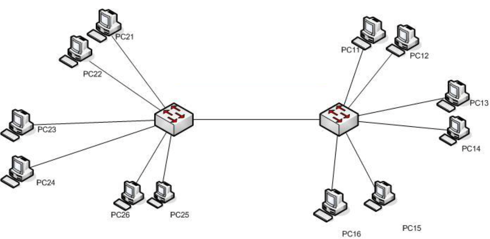
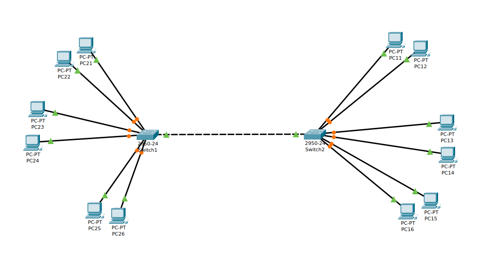

# CONFIGURACIÓN DE VLAN CON PUERTOS TRONCALES

Dado el esquema de red siguiente en el que el cable entre los dos switches es un enlace troncal configurado para las `VLAN 10`, `VLAN 20` y `VLAN 30`:

Y con el direccionamiento `ip`  siguiente:

| HOST | DIRECCIÓN IP | VLAN | INTERFACE SW1 | INTERFACE SW2 |
| ---- | ------------ | ---- | ------------- | ------------- |
| PC11 | 10.0.0.11/24 | 10   | -             | Fa0/2         |
| PC12 | 10.0.0.12/24 | 10   | -             | Fa0/3         |
| PC13 | 10.0.0.13/24 | 20   | -             | Fa0/4         |
| PC14 | 10.0.0.14/24 | 20   | -             | Fa0/5         |
| PC15 | 10.0.0.15/24 | 30   | -             | Fa0/6         |
| PC16 | 10.0.0.16/24 | 30   | -             | Fa0/7         |
| PC21 | 10.0.0.21/24 | 10   | Fa0/2         | -             |
| PC22 | 10.0.0.22/24 | 10   | Fa0/3         | -             |
| PC23 | 10.0.0.23/24 | 20   | Fa0/4         | -             |
| PC24 | 10.0.0.24/24 | 20   | Fa0/5         | -             |
| PC25 | 10.0.0.25/24 | 30   | Fa0/6         | -             |
| PC26 | 10.0.0.26/24 | 30   | Fa0/7         | -             |

Los switches son del tipo ***Cisco 2950-24*** y están conectados entre si por medio de un enlace troncal.

Responde a las siguientes preguntas:

1. Monta la topología en **Packet Tracer** y adjunta una imagen final

2. Confifura en cada switch las `VLAN`:

 + SW1 
~~~
SW1(config)#vlan 10
SW1(config-vlan)#name ventas
SW1(config-vlan)#exit
SW1(config)#vlan 20
SW1(config-vlan)#name taller
SW1(config-vlan)#exit
SW1(config)#vlan 30
SW1(config-vlan)#name markeing
~~~

 + SW2
~~~
SW2(config)#vlan 10
SW2(config-vlan)#name ventas
SW2(config-vlan)#exit
SW2(config)#vlan 20
SW2(config-vlan)#name taller
SW2(config-vlan)#exit
SW2(config)#vlan 30
SW2(config-vlan)#name markeing
~~~

3. Configura cada uno de los puertos de los switches asignándolos a la `VLAN` que le corresponda, con la información que se da en las tablas del enunciado.

~~~
Como el archivo que he usado para hacer esta práctica es el mismo que el de la anterior, este paso no ha sido necesario, ya que todo estaba configurado al volver a crear cada Vlan.
~~~

4. Configure el enlace troncal entre los dos switches:

+ SW1
~~~
SW1(config-if)#switchport mode trunk
SW1(config-if)#switchport trunk allowed vlan 10,20,30

SW1#show interfaces trunk 
Port        Mode         Encapsulation  Status        Native vlan
Fa0/20      on           802.1q         trunking      1

Port        Vlans allowed on trunk
Fa0/20      10,20,30

Port        Vlans allowed and active in management domain
Fa0/20      10,20,30

Port        Vlans in spanning tree forwarding state and not pruned
Fa0/20      10,20,30
~~~
+  SW2
~~~
SW2(config-if)#switchport mode trunk
SW2(config-if)#switchport trunk allowed vlan 10,20,30

SW2#show interfaces trunk 
Port        Mode         Encapsulation  Status        Native vlan
Fa0/20      on           802.1q         trunking      1

Port        Vlans allowed on trunk
Fa0/20      10,20,30

Port        Vlans allowed and active in management domain
Fa0/20      10,20,30

Port        Vlans in spanning tree forwarding state and not pruned
Fa0/20      30
~~~

5. Muestra un resumen de las `VLAN` configuradas en cada switch:

+ SW1 
~~~
show vlan

VLAN Name                             Status    Ports
---- -------------------------------- --------- -------------------------------
1    default                          active    Fa0/1, Fa0/8, Fa0/9, Fa0/10
                                                Fa0/11, Fa0/12, Fa0/13, Fa0/14
                                                Fa0/15, Fa0/16, Fa0/17, Fa0/18
                                                Fa0/19, Fa0/21
10   ventas                           active    Fa0/2, Fa0/3, Fa0/24
20   taller                           active    Fa0/4, Fa0/5, Fa0/23
30   marketing                        active    Fa0/6, Fa0/7, Fa0/22
1002 fddi-default                     active    
1003 token-ring-default               active    
1004 fddinet-default                  active    
1005 trnet-default                    active    
~~~
+  SW2
~~~
SW2#show vlan

VLAN Name                             Status    Ports
---- -------------------------------- --------- -------------------------------
1    default                          active    Fa0/1, Fa0/8, Fa0/9, Fa0/10
                                                Fa0/11, Fa0/12, Fa0/13, Fa0/14
                                                Fa0/15, Fa0/16, Fa0/17, Fa0/18
                                                Fa0/19, Fa0/20, Fa0/21
10   ventas                           active    Fa0/2, Fa0/3, Fa0/24
20   taller                           active    Fa0/4, Fa0/5, Fa0/23
30   marketing                        active    Fa0/6, Fa0/7, Fa0/22
1002 fddi-default                     active    
1003 token-ring-default               active    
1004 fddinet-default                  active    
1005 trnet-default                    active 
~~~

6. Comprueba, mediante `PING`, que hay comunicación entre los equipos que pertenecen a una misma `VLAN`

+ VLAN10
~~~
C:\>ping 10.0.0.11

Pinging 10.0.0.11 with 32 bytes of data:

Reply from 10.0.0.11: bytes=32 time<1ms TTL=128
Reply from 10.0.0.11: bytes=32 time<1ms TTL=128
Reply from 10.0.0.11: bytes=32 time<1ms TTL=128
Reply from 10.0.0.11: bytes=32 time=4ms TTL=128

Ping statistics for 10.0.0.11:
    Packets: Sent = 4, Received = 4, Lost = 0 (0% loss),
Approximate round trip times in milli-seconds:
    Minimum = 0ms, Maximum = 4ms, Average = 1ms

    Lo hacemos con otra VLAN:

C:\>ping 10.0.0.15

Pinging 10.0.0.15 with 32 bytes of data:

Request timed out.
Request timed out.
Request timed out.
Request timed out.

Ping statistics for 10.0.0.15:
    Packets: Sent = 4, Received = 0, Lost = 4 (100% loss),
~~~
+ VLAN20
~~~
C:\>ping 10.0.0.14

Pinging 10.0.0.14 with 32 bytes of data:

Reply from 10.0.0.14: bytes=32 time<1ms TTL=128
Reply from 10.0.0.14: bytes=32 time<1ms TTL=128
Reply from 10.0.0.14: bytes=32 time<1ms TTL=128
Reply from 10.0.0.14: bytes=32 time<1ms TTL=128

Ping statistics for 10.0.0.14:
    Packets: Sent = 4, Received = 4, Lost = 0 (0% loss),
Approximate round trip times in milli-seconds:
    Minimum = 0ms, Maximum = 0ms, Average = 0ms
~~~
+ VLAN30
~~~
C:\>ping 10.0.0.16

Pinging 10.0.0.16 with 32 bytes of data:

Reply from 10.0.0.16: bytes=32 time<1ms TTL=128
Reply from 10.0.0.16: bytes=32 time<1ms TTL=128
Reply from 10.0.0.16: bytes=32 time<1ms TTL=128
Reply from 10.0.0.16: bytes=32 time<1ms TTL=128

Ping statistics for 10.0.0.16:
    Packets: Sent = 4, Received = 4, Lost = 0 (0% loss),
Approximate round trip times in milli-seconds:
    Minimum = 0ms, Maximum = 0ms, Average = 0ms
~~~
