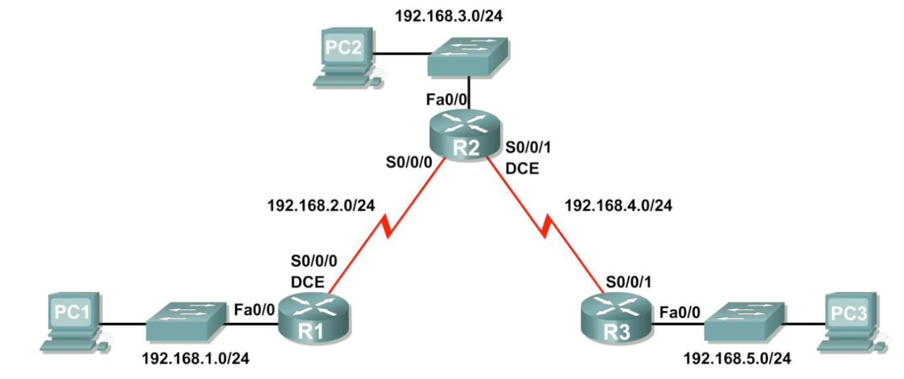
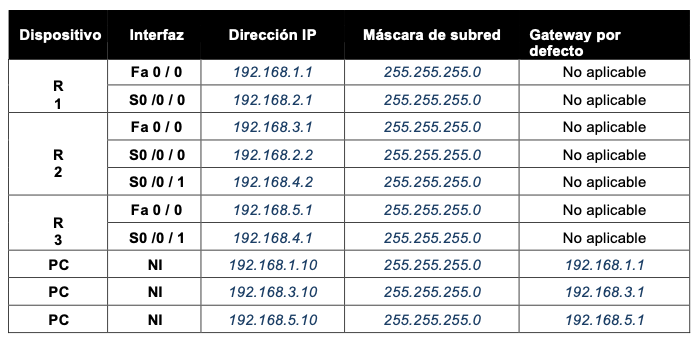
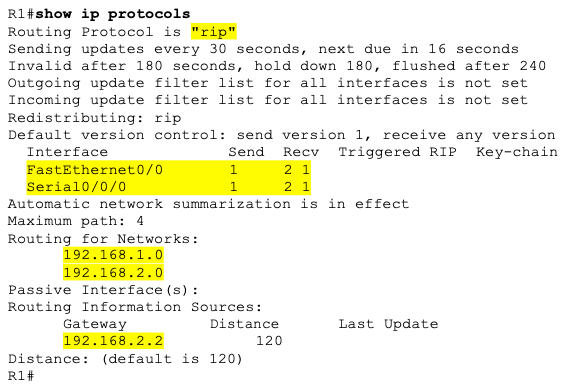
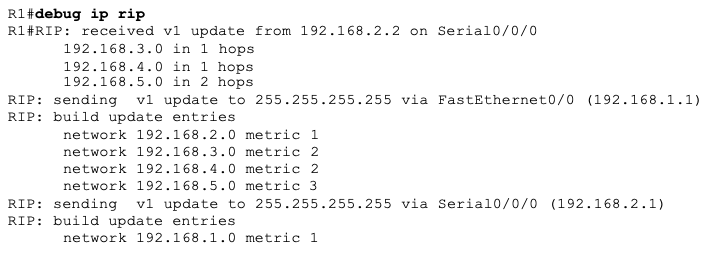

# CONFIGURACIÓN BÁSICA DEL PROTOCOLO DE ENRUTAMIENTO DINÁMICO RIP V1

Dada la siguiente topología:

### RIPv1 EN REDES CON CLASE

Tabla de direccionamiento:

1. Crea la topología en ***Packet Tracer***. Puede utilizar cualquier router que actualmente tenga en el laboratorio, siempre y cuando cuente con las interfaces necesarias que se muestran en la topología.

>***Nota***: Si utiliza routers 1700, 2500 ó 2600, los resultados y las descripciones del router aparecerán en forma diferente.

2. Borra las configuraciones que tengan los routers.

R1

~~~
R1#erase startup-config 
~~~

R2

~~~
R2#erase startup-config 
~~~

R3

~~~
R3#erase startup-config 
~~~

3. Realiza las configuraciones básicas de los routers **R1**, **R2** y **R3** de acuerdo con las siguientes instrucciones:

+ Configure el nombre de host del router.
+ Desactive la búsqueda `DNS`.
+ Configure la contraseña ***cisco*** de modo `EXEC`.
+ Configure un mensaje del día ***BIENVENIDO AL ROUTER R1,R2,R3***.
+ Configure la contraseña ***1234*** para las conexiones de la consola.
+ Configure la contraseña ***4321*** para las conexiones de `VTY`.

R1

~~~
Router(config)#hostname R1
R1(config)#no ip domain-lookup
#banner motd # Hola al Router R1#
R1(config)#enable password cisco
R1(config)#line console 0
R1(config-line)#password 1234
R1(config-line)#line vty 0 4
R1(config-line)#password 4321
~~~

R2

~~~
Router(config)#hostname R2
R2(config)#no ip domain-lookup
R2(config)#banner motd # Hola al Router R2#
R2(config)#enable password cisco
R2(config)#line console 0
R2(config-line)#password 1234
R2(config-line)#line vty 0 4
R2(config-line)#password 4321
~~~

R3

~~~
Router(config)#hostname R3
R3(config)#no ip domain-lookup
R3(config)#banner motd # Hola al Router R3#
R3(config)#enable password cisco
R3(config)#line console 0
R3(config-line)#password 1234
R3(config-line)#line vty 0 4
R3(config-line)#password 4321
~~~

4. Configure las interfaces de los routers **R1**, **R2** y **R3** con las direcciones `IP` dadas en la tabla.

R1

~~~
R1(config)#interface FastEthernet0/0
R1(config-if)#ip address 192.168.1.1 255.255.255.0
R1(config-if)#no shutdown
R1(config)#interface Serial2/0
R1(config-if)#ip address 192.168.2.1 255.255.255.0
R1(config-if)#ip address 192.168.2.1 255.255.255.0
R1(config-if)#no shutdown
~~~

R2

~~~
R2(config)#interface FastEthernet0/0
R2(config-if)#ip address 192.168.3.1 255.255.255.0
R2(config-if)#no shutdown
R2(config)#interface Serial2/0
R2(config-if)#no shutdown
ip address 192.168.2.2 255.255.255.0
R2(config-if)#ip address 192.168.2.2 255.255.255.0
R2(config)#interface Serial3/0
R2(config-if)#ip address 192.168.4.2 255.255.255.0
R2(config-if)#no shutdown
~~~

R3

~~~
R3(config)#interface FastEthernet0/0
R3(config-if)#ip address 192.168.5.1 255.255.255.0
R3(config-if)#no shutdown
R3(config)#interface Serial3/0
R3(config-if)#no shutdown
ip address 192.168.4.1 255.255.255.0
R3(config-if)#ip address 192.168.4.1 255.255.255.0
~~~

5. Verifique el direccionamiento `IP` y las interfaces.

R1

~~~
R1>show ip interface brief
Interface              IP-Address      OK? Method Status                Protocol 
FastEthernet0/0        192.168.1.1     YES manual up                    up 
FastEthernet1/0        unassigned      YES unset  administratively down down 
Serial2/0              192.168.2.1     YES manual up                    up 
Serial3/0              unassigned      YES unset  administratively down down 
FastEthernet4/0        unassigned      YES unset  administratively down down 
FastEthernet5/0        unassigned      YES unset  administratively down down
~~~

R2

~~~
R2#show ip interface brief
Interface              IP-Address      OK? Method Status                Protocol 
FastEthernet0/0        192.168.3.1     YES manual up                    up 
FastEthernet1/0        unassigned      YES unset  administratively down down 
Serial2/0              192.168.2.2     YES manual up                    up 
Serial3/0              192.168.4.2     YES manual up                    up 
FastEthernet4/0        unassigned      YES unset  administratively down down 
FastEthernet5/0        unassigned      YES unset  administratively down down
~~~

R3

~~~
R3#show ip interface brief 
Interface              IP-Address      OK? Method Status                Protocol 
FastEthernet0/0        192.168.5.1     YES manual up                    up 
FastEthernet1/0        unassigned      YES unset  administratively down down 
Serial2/0              unassigned      YES unset  administratively down down 
Serial3/0              192.168.4.1     YES manual up                    up 
FastEthernet4/0        unassigned      YES unset  administratively down down 
FastEthernet5/0        unassigned      YES unset  administratively down down
~~~

6.  Configure las interfaces Ethernet de **PC1**, **PC2** y **PC3** con las direcciones `IP` y gateways por defecto de la tabla. Pruebe la configuración ejecutando un `ping` desde el **PC** al gateway por defecto.

PC1

~~~
C:\>ping 192.168.1.1

Pinging 192.168.1.1 with 32 bytes of data:

Reply from 192.168.1.1: bytes=32 time<1ms TTL=255
Reply from 192.168.1.1: bytes=32 time<1ms TTL=255
Reply from 192.168.1.1: bytes=32 time<1ms TTL=255
Reply from 192.168.1.1: bytes=32 time<1ms TTL=255

Ping statistics for 192.168.1.1:
    Packets: Sent = 4, Received = 4, Lost = 0 (0% loss),
Approximate round trip times in milli-seconds:
    Minimum = 0ms, Maximum = 0ms, Average = 0ms
~~~

PC2

~~~
C:\>ping 192.168.3.1

Pinging 192.168.3.1 with 32 bytes of data:

Reply from 192.168.3.1: bytes=32 time<1ms TTL=255
Reply from 192.168.3.1: bytes=32 time<1ms TTL=255
Reply from 192.168.3.1: bytes=32 time<1ms TTL=255
Reply from 192.168.3.1: bytes=32 time<1ms TTL=255

Ping statistics for 192.168.3.1:
    Packets: Sent = 4, Received = 4, Lost = 0 (0% loss),
Approximate round trip times in milli-seconds:
    Minimum = 0ms, Maximum = 0ms, Average = 0ms
~~~

PC3

~~~
C:\>ping 192.168.5.1

Pinging 192.168.5.1 with 32 bytes of data:

Reply from 192.168.5.1: bytes=32 time<1ms TTL=255
Reply from 192.168.5.1: bytes=32 time<1ms TTL=255
Reply from 192.168.5.1: bytes=32 time<1ms TTL=255
Reply from 192.168.5.1: bytes=32 time<1ms TTL=255

Ping statistics for 192.168.5.1:
    Packets: Sent = 4, Received = 4, Lost = 0 (0% loss),
Approximate round trip times in milli-seconds:
    Minimum = 0ms, Maximum = 0ms, Average = 0ms
~~~

7. Habilite un enrutamiento dinámico.

Para habilitar un protocolo de enrutamiento dinámico, ingrese al modo de configuración global y utilice el comando `router`.

Ingrese `router ?` en el indicador de configuración global para visualizar una lista de los protocolos de enrutamiento disponibles en el router.

Para habilitar `RIP`, ingrese el comando `router rip` en el modo de configuración global.

R1

~~~
R1(config)#router ?
  bgp    Border Gateway Protocol (BGP)
  eigrp  Enhanced Interior Gateway Routing Protocol (EIGRP)
  ospf   Open Shortest Path First (OSPF)
  rip    Routing Information Protocol (RIP)
R1(config)#router rif
                    ^
% Invalid input detected at '^' marker.
	
R1(config)#router rip
~~~

R2

~~~
R2(config)#router ?
  bgp    Border Gateway Protocol (BGP)
  eigrp  Enhanced Interior Gateway Routing Protocol (EIGRP)
  ospf   Open Shortest Path First (OSPF)
  rip    Routing Information Protocol (RIP)
R2(config)#router 
% Incomplete command.
R2(config)#router rip
~~~

R3

~~~
R3(config)#router ?
  bgp    Border Gateway Protocol (BGP)
  eigrp  Enhanced Interior Gateway Routing Protocol (EIGRP)
  ospf   Open Shortest Path First (OSPF)
  rip    Routing Information Protocol (RIP)
R3(config)#router rip
~~~

8. Ingrese la dirección de red con clase para cada red conectada directamente por medio del comando `network`. Este comando hace lo siguiente:
+ Habilita a `RIP` en todas las interfaces que pertenezcan a esta red. Ahora estas interfaces enviarán y recibirán actualizaciones `RIP`.
+ Notifica esta red en actualizaciones de enrutamiento RIP que se envían a otros routers cada 30 segundos.

R1

~~~
R1(config-router)#network 192.168.2.0
R1(config-router)#network 192.168.1.0
~~~

R2

~~~
R2(config-router)#network 192.168.2.0
R2(config-router)#network 192.168.3.0
R2(config-router)#network 192.168.4.0
~~~

R3

~~~
R3(config-router)#network 192.168.4.0
R3(config-router)#network 192.168.5.0
~~~

9. Utilice el comando `show ip route` para verificar que cada router cuente con todas las redes en la topología ingresadas en la tabla de enrutamiento. Las rutas reveladas a través de `RIP` se codifican con una **R** en la tabla de enrutamiento.

R1

~~~
R1#show ip route
Codes: C - connected, S - static, I - IGRP, R - RIP, M - mobile, B - BGP
       D - EIGRP, EX - EIGRP external, O - OSPF, IA - OSPF inter area
       N1 - OSPF NSSA external type 1, N2 - OSPF NSSA external type 2
       E1 - OSPF external type 1, E2 - OSPF external type 2, E - EGP
       i - IS-IS, L1 - IS-IS level-1, L2 - IS-IS level-2, ia - IS-IS inter area
       * - candidate default, U - per-user static route, o - ODR
       P - periodic downloaded static route

Gateway of last resort is not set

C    192.168.1.0/24 is directly connected, FastEthernet0/0
C    192.168.2.0/24 is directly connected, Serial2/0
R    192.168.3.0/24 [120/1] via 192.168.2.2, 00:00:05, Serial2/0
R    192.168.4.0/24 [120/1] via 192.168.2.2, 00:00:05, Serial2/0
R    192.168.5.0/24 [120/2] via 192.168.2.2, 00:00:05, Serial2/0
~~~

R2

~~~
R2#show ip route
Codes: C - connected, S - static, I - IGRP, R - RIP, M - mobile, B - BGP
       D - EIGRP, EX - EIGRP external, O - OSPF, IA - OSPF inter area
       N1 - OSPF NSSA external type 1, N2 - OSPF NSSA external type 2
       E1 - OSPF external type 1, E2 - OSPF external type 2, E - EGP
       i - IS-IS, L1 - IS-IS level-1, L2 - IS-IS level-2, ia - IS-IS inter area
       * - candidate default, U - per-user static route, o - ODR
       P - periodic downloaded static route

Gateway of last resort is not set

R    192.168.1.0/24 [120/1] via 192.168.2.1, 00:00:01, Serial2/0
C    192.168.2.0/24 is directly connected, Serial2/0
C    192.168.3.0/24 is directly connected, FastEthernet0/0
C    192.168.4.0/24 is directly connected, Serial3/0
R    192.168.5.0/24 [120/1] via 192.168.4.1, 00:00:21, Serial3/0
~~~

R3

~~~
R3#show ip route
Codes: C - connected, S - static, I - IGRP, R - RIP, M - mobile, B - BGP
       D - EIGRP, EX - EIGRP external, O - OSPF, IA - OSPF inter area
       N1 - OSPF NSSA external type 1, N2 - OSPF NSSA external type 2
       E1 - OSPF external type 1, E2 - OSPF external type 2, E - EGP
       i - IS-IS, L1 - IS-IS level-1, L2 - IS-IS level-2, ia - IS-IS inter area
       * - candidate default, U - per-user static route, o - ODR
       P - periodic downloaded static route

Gateway of last resort is not set

R    192.168.1.0/24 [120/2] via 192.168.4.2, 00:00:28, Serial3/0
R    192.168.2.0/24 [120/1] via 192.168.4.2, 00:00:28, Serial3/0
R    192.168.3.0/24 [120/1] via 192.168.4.2, 00:00:28, Serial3/0
C    192.168.4.0/24 is directly connected, Serial3/0
C    192.168.5.0/24 is directly connected, FastEthernet0/0
~~~

10. Utilice el comando `show ip protocols` para visualizar la información acerca de los procesos de enrutamiento. Se puede utilizar este resultado para verificar los parámetros `RIP` para confirmar que:

-   El uso del enrutamiento `RIP` está configurado.
-   Las interfaces correctas envían y reciben las actualizaciones `RIP`.
-   El router notifica las redes correctas.
-   Los vecinos `RIP` están enviando actualizaciones.

En la imagen vemos que:
+ **R1** sí está configurado con `RIP`. 
+ **R1** está enviando y recibiendo actualizaciones `RIP` en `FastEthernet0/0` y `Serial0/0/0`. 
+ **R1** está notificando las redes `192.168.1.0` y `192.168.2.0`. 
+ **R1** tiene una fuente de información de enrutamiento. **R2** le está enviando actualizaciones a **R1**.

R1

~~~
R1#show ip protocols 
Routing Protocol is "rip"
Sending updates every 30 seconds, next due in 12 seconds
Invalid after 180 seconds, hold down 180, flushed after 240
Outgoing update filter list for all interfaces is not set
Incoming update filter list for all interfaces is not set
Redistributing: rip
Default version control: send version 1, receive any version
  Interface             Send  Recv  Triggered RIP  Key-chain
  FastEthernet0/0       12 1
  Serial2/0             12 1
Automatic network summarization is in effect
Maximum path: 4
Routing for Networks:
	192.168.1.0
	192.168.2.0
Passive Interface(s):
Routing Information Sources:
	Gateway         Distance      Last Update
	192.168.2.2          120      00:00:21
Distance: (default is 120)
R1#
~~~

R2

~~~
R2#show ip protocols
Routing Protocol is "rip"
Sending updates every 30 seconds, next due in 21 seconds
Invalid after 180 seconds, hold down 180, flushed after 240
Outgoing update filter list for all interfaces is not set
Incoming update filter list for all interfaces is not set
Redistributing: rip
Default version control: send version 1, receive any version
  Interface             Send  Recv  Triggered RIP  Key-chain
  FastEthernet0/0       12 1
  Serial2/0             12 1
  Serial3/0             12 1
Automatic network summarization is in effect
Maximum path: 4
Routing for Networks:
	192.168.2.0
	192.168.3.0
	192.168.4.0
Passive Interface(s):
Routing Information Sources:
	Gateway         Distance      Last Update
	192.168.2.1          120      00:00:25
	192.168.4.1          120      00:00:14
Distance: (default is 120)
~~~

R3

~~~
R3#show ip protocols 
Routing Protocol is "rip"
Sending updates every 30 seconds, next due in 20 seconds
Invalid after 180 seconds, hold down 180, flushed after 240
Outgoing update filter list for all interfaces is not set
Incoming update filter list for all interfaces is not set
Redistributing: rip
Default version control: send version 1, receive any version
  Interface             Send  Recv  Triggered RIP  Key-chain
  FastEthernet0/0       12 1
  Serial3/0             12 1
Automatic network summarization is in effect
Maximum path: 4
Routing for Networks:
	192.168.4.0
	192.168.5.0
Passive Interface(s):
Routing Information Sources:
	Gateway         Distance      Last Update
	192.168.4.2          120      00:00:27
Distance: (default is 120)
~~~

11. Utilice el comando `debug ip rip` para visualizar los mensajes `RIP` que se envían y reciben.Las actualizaciones `RIP` se envían cada 30 segundos, por lo que deberá esperar para visualizar la información de depuración.

El resultado de la depuración muestra que **R1** recibe una actualización de **R2**. Observe cómo esta actualización incluye todas las redes que **R1** aún no tiene en su tabla de enrutamiento. Debido a que  la interfaz `FastEthernet0/0` pertenece a la red `192.168.1.0` configurada en `RIP`, **R1** crea una actualización para enviar a esa interfaz. La actualización incluye todas las redes conocidas para **R1**, excepto la red  
de la interfaz. Por último, **R1** crea una actualización para enviar a **R2**. Debido a este horizonte dividido, **R1** sólo incluye en la actualización la red `192.168.1.0`.

R1

~~~
R1#debug ip rip 
RIP protocol debugging is on
R1#RIP: received v1 update from 192.168.2.2 on Serial2/0
      192.168.3.0 in 1 hops
      192.168.4.0 in 1 hops
      192.168.5.0 in 2 hops
RIP: sending  v1 update to 255.255.255.255 via FastEthernet0/0 (192.168.1.1)
RIP: build update entries
      network 192.168.2.0 metric 1
      network 192.168.3.0 metric 2
      network 192.168.4.0 metric 2
      network 192.168.5.0 metric 3
RIP: sending  v1 update to 255.255.255.255 via Serial2/0 (192.168.2.1)
RIP: build update entries
      network 192.168.1.0 metric 1
~~~

R2

~~~
R2#debug ip rip 
RIP protocol debugging is on
R2#RIP: received v1 update from 192.168.2.1 on Serial2/0
      192.168.1.0 in 1 hops
RIP: received v1 update from 192.168.4.1 on Serial3/0
      192.168.5.0 in 1 hops
RIP: sending  v1 update to 255.255.255.255 via FastEthernet0/0 (192.168.3.1)
RIP: build update entries
      network 192.168.1.0 metric 2
      network 192.168.2.0 metric 1
      network 192.168.4.0 metric 1
      network 192.168.5.0 metric 2
RIP: sending  v1 update to 255.255.255.255 via Serial2/0 (192.168.2.2)
RIP: build update entries
      network 192.168.3.0 metric 1
      network 192.168.4.0 metric 1
      network 192.168.5.0 metric 2
RIP: sending  v1 update to 255.255.255.255 via Serial3/0 (192.168.4.2)
RIP: build update entries
      network 192.168.1.0 metric 2
      network 192.168.2.0 metric 1
      network 192.168.3.0 metric 1
RIP: received v1 update from 192.168.2.1 on Serial2/0
      192.168.1.0 in 1 hops

~~~

R3

~~~
R3#debug ip rip 
RIP protocol debugging is on
R3#RIP: sending  v1 update to 255.255.255.255 via FastEthernet0/0 (192.168.5.1)
RIP: build update entries
      network 192.168.1.0 metric 3
      network 192.168.2.0 metric 2
      network 192.168.3.0 metric 2
      network 192.168.4.0 metric 1
RIP: sending  v1 update to 255.255.255.255 via Serial3/0 (192.168.4.1)
RIP: build update entries
      network 192.168.5.0 metric 1
RIP: received v1 update from 192.168.4.2 on Serial3/0
      192.168.1.0 in 2 hops
      192.168.2.0 in 1 hops
      192.168.3.0 in 1 hops
~~~

12. Detenga el resultado de la depuración con el comando `undebug all`

R1

~~~
R1#undebug all
All possible debugging has been turned off
~~~

R2

~~~
R3#undebug all
All possible debugging has been turned off
~~~

R3

~~~
R3#undebug all
All possible debugging has been turned off
~~~

13. Comprobamos que ha funcionado con Pings entre PC

+ 1-2
~~~
C:\>ping 192.168.3.1

Pinging 192.168.3.1 with 32 bytes of data:

Reply from 192.168.3.1: bytes=32 time=1ms TTL=254
Reply from 192.168.3.1: bytes=32 time=20ms TTL=254
Reply from 192.168.3.1: bytes=32 time=1ms TTL=254
Reply from 192.168.3.1: bytes=32 time=13ms TTL=254

Ping statistics for 192.168.3.1:
    Packets: Sent = 4, Received = 4, Lost = 0 (0% loss),
Approximate round trip times in milli-seconds:
    Minimum = 1ms, Maximum = 20ms, Average = 8ms
~~~
+ 2-3
~~~

C:\>ping 192.168.5.1

Pinging 192.168.5.1 with 32 bytes of data:

Reply from 192.168.5.1: bytes=32 time=1ms TTL=254
Reply from 192.168.5.1: bytes=32 time=4ms TTL=254
Reply from 192.168.5.1: bytes=32 time=1ms TTL=254
Reply from 192.168.5.1: bytes=32 time=1ms TTL=254

Ping statistics for 192.168.5.1:
    Packets: Sent = 4, Received = 4, Lost = 0 (0% loss),
Approximate round trip times in milli-seconds:
    Minimum = 1ms, Maximum = 4ms, Average = 1ms
~~~
+ 1-3
~~~
C:\>ping 192.168.5.1

Pinging 192.168.5.1 with 32 bytes of data:

Reply from 192.168.5.1: bytes=32 time=2ms TTL=253
Reply from 192.168.5.1: bytes=32 time=12ms TTL=253
Reply from 192.168.5.1: bytes=32 time=15ms TTL=253
Reply from 192.168.5.1: bytes=32 time=2ms TTL=253

Ping statistics for 192.168.5.1:
    Packets: Sent = 4, Received = 4, Lost = 0 (0% loss),
Approximate round trip times in milli-seconds:
    Minimum = 2ms, Maximum = 15ms, Average = 7ms
~~~