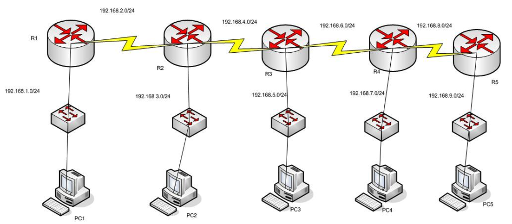

# ENRUTAMIENTO DINÁMICO RIP V1

Dada la siguiente topología de red:

1. Crear el siguiente esquema de red usando el ***Packet Tracert***. Configurar las interfaces de cada router y asignarle una dirección `IP` por cada interfaz.

+ R1

 ~~~
Router(config)#interface serial 2/0
Router(config-if)#ip address 192.168.2.1 255.255.255.0
Router(config-if)#no shutdown 
Router(config-if)#exit
Router(config)#interface fastEthernet 0/0
Router(config-if)#ip address 192.168.1.1 255.255.255.0
Router(config-if)#no shutdown
 ~~~

+ R2

 ~~~
Router(config)#interface serial 3/0
Router(config-if)#ip address 192.168.2.1 255.255.255.0
Router(config-if)#no shutdown 
Router(config)#interface serial 2/0
Router(config-if)#ip address 192.168.4.1 255.255.255.0
Router(config-if)#no shutdown 
Router(config-if)#exit
Router(config)#interface fastEthernet 0/0
Router(config-if)#ip address 192.168.3.1 255.255.255.0
Router(config-if)#no shutdown 
 ~~~
 
 + R3
 
 ~~~
Router(config)#interface serial 3/0
Router(config-if)#ip address 192.168.4.1 255.255.255.0
Router(config-if)#no shutdown 
Router(config-if)#exit
Router(config)#interface serial 2/0
Router(config-if)#ip address 192.168.6.1 255.255.255.0
Router(config-if)#no shutdown 
Router(config-if)#exit
Router(config)#interface fastEthernet 0/0
Router(config-if)#ip address 192.168.5.1 255.255.255.0
Router(config-if)#no shutdown
 ~~~
 
 + R4
 
 ~~~
Router(config)#interface serial 3/0
Router(config-if)#ip address 192.168.6.1 255.255.255.0
Router(config-if)#no shutdown 
Router(config-if)#exit
Router(config)#interface serial 2/0
Router(config-if)#ip address 192.168.8.1 255.255.255.0
Router(config-if)#no shutdown 
Router(config-if)#exit
Router(config)#interface fastEthernet 0/0
Router(config-if)#ip address 192.168.7.1 255.255.255.0
Router(config-if)#no shutdown 
 ~~~
 
 + R5
 
 ~~~
 Router(config)#interface serial 3/0
Router(config-if)#ip address 192.168.8.1 255.255.255.0
Router(config-if)#no shutdown 
Router(config-if)#exit
Router(config)#interface fastEthernet 0/0
Router(config-if)#ip address 192.168.9.1 255.255.255.0
Router(config-if)#no shutdown
 ~~~

2. Activar el protocolo `RIP` en cada uno de los routers de la figura de arriba.

+ R1

 ~~~
Router(config)#router rip

 ~~~

+ R2

 ~~~
 Router(config)#router rip
 ~~~
 
 + R3
 
 ~~~
Router(config)#router rip
 ~~~
 
 + R4
 
 ~~~
 Router(config)#router rip
 ~~~
 
 + R5
 
 ~~~
 Router(config)#router rip
 ~~~

3. Publicar las redes con el protocolo `RIP` en cada una de los routers. 

+ R1

 ~~~
Router(config-router)#network 192.168.2.0
Router(config-router)#network 172.168.1.0
 ~~~

+ R2

 ~~~
Router(config-router)#network 192.168.2.0
Router(config-router)#network 192.168.4.0
Router(config-router)#network 192.168.3.0
 ~~~
 
+  R3

 ~~~
Router(config-router)#network 192.168.4.0
Router(config-router)#network 192.168.6.0
Router(config-router)#network 192.168.5.0
 ~~~
 
 + R4
 
 ~~~
Router(config)#router rip
Router(config-router)#network 192.168.6.0
Router(config-router)#network 192.168.8.4
Router(config-router)#network 192.168.7.0
 ~~~
 
 + R5
 
 ~~~
Router(config-router)#network 192.168.9.0
Router(config-router)#network 192.168.8.0
 ~~~

5. Muestra la tabla de enrutamiento del router **R3** para verificar si ha "aprendido" las redes de sus vecinos.

 + R3
 
 ~~~
 C    192.168.4.0/24 is directly connected, Serial3/0
C    192.168.5.0/24 is directly connected, FastEthernet0/0
C    192.168.6.0/24 is directly connected, Serial2/0
 ~~~

 + Comprobar si la distancia a las redes se corresponde con la métrica. Considerando que en `RIP` la métrica es el número de saltos. Por ejemplo la red `192.168.8.0/24` debe tener métrica 2.
 + ¿Cual es la distancia administrativa de las redes aprendidas por `RIP`?

 + R3
 
 ~~~
 ~~~

6. Activar el modo de depuración en el router R2.

 + R2
 
 ~~~
 R2#debug
 ~~~

+ ¿Cuáles son las rutas las rutas enviadas por R2 a R1?

~~~
~~~

+ ¿Cuáles son las rutas las rutas recibidas en R2 por parte de R3?

~~~
~~~

+ Razonar, analizando los apartados a y b, si funciona el horizonte dividido.

~~~
~~~

7. Como se observa en el esquema de red, por la parte de la red Ethernet no hay ningún router, por tanto, se quiere evitar que el router no mande tráfico `RIP` por esa interfaz, ¿Qué se debe de hacer?

 + R1
 
 ~~~
R1(config)# router rip
R1(config-router)# passive-interface Ethernet 0/0

 ~~~

+ R2

 ~~~
R1(config)# router rip
R1(config-router)# passive-interface Ethernet 0/0
 ~~~
 
 + R3
 
 ~~~
R1(config)# router rip
R1(config-router)# passive-interface Ethernet 0/0
 ~~~
 
 + R4
 
 ~~~
R1(config)# router rip
R1(config-router)# passive-interface Ethernet 0/0
 ~~~
 
 + R5
 
 ~~~
R1(config)# router rip
R1(config-router)# passive-interface Ethernet 0/0
 ~~~

8. Usando `show ip protocolos` en el router R2 y contestar a las siguientes preguntas:

+ ¿ Qué versión se está enviando?

~~~
R2#show ip protocols
Routing Protocol is "rip"
~~~

+ ¿ Qué versión se acepta?

~~~
Default version control: send version 1, receive any version
~~~

+ ¿ Cada cuanto tiempo se envían las tablas de rutas ?

~~~
Sending updates every 30 seconds, next due in 10 seconds
Invalid after 180 seconds, hold down 180, flushed after 240
~~~

+ ¿ Qué redes están siendo publicadas por el `RIP` ?

~~~
Routing for Networks:
	192.168.2.0
	192.168.3.0
	192.168.4.0
~~~

