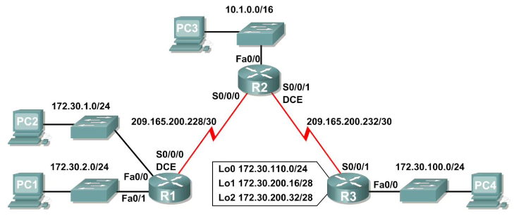
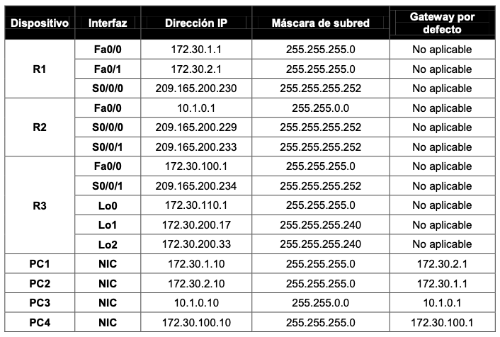
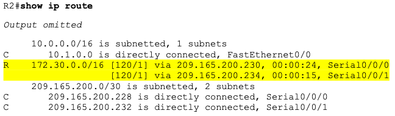
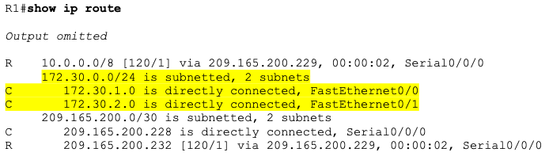
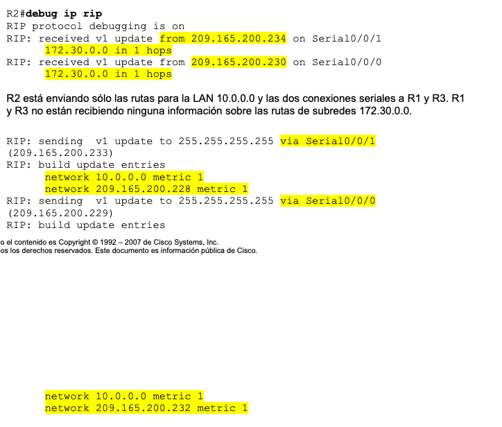
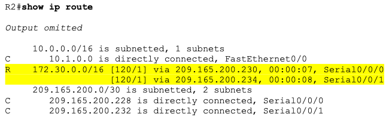
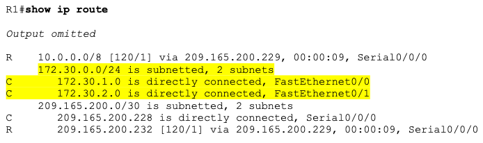
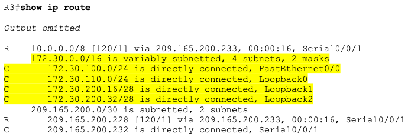
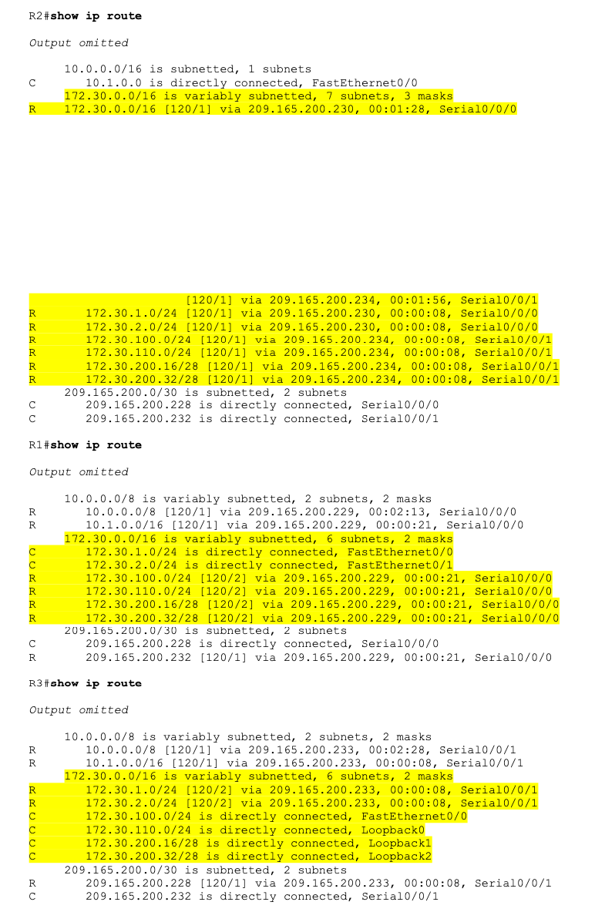

# CONFIGURACIÓN BÁSICA DE  RIP V2

Dada la topología:

Y la tabla de direccionamiento es la siguiente:

1. Crea en **Packet Tracer** la topología y asigna las direcciones `IP` en base a la tabla anterior. Inserta una imagen de la topología creada.

2. Eliminar la configuración en cada router.

+ R1 
~~~
Router#erase startup-config 
Erasing the nvram filesystem will remove all configuration files! Continue? [confirm]
[OK]
Erase of nvram: complete
%SYS-7-NV_BLOCK_INIT: Initialized the geometry of nvram
~~~

+ R2
~~~
Router#erase startup-config 
Erasing the nvram filesystem will remove all configuration files! Continue? [confirm]
[OK]
Erase of nvram: complete
%SYS-7-NV_BLOCK_INIT: Initialized the geometry of nvram
~~~

+ R3
~~~
Router#erase startup-config 
Erasing the nvram filesystem will remove all configuration files! Continue? [confirm]
[OK]
Erase of nvram: complete
%SYS-7-NV_BLOCK_INIT: Initialized the geometry of nvram
~~~

3. Revisa, discute y carga en cada uno de los routers las siguientes configuraciones:

+ R1 
~~~
!
hostname R1
!
!
!
interface FastEthernet1/0
 ip address 172.30.1.1 255.255.255.0
 duplex auto
 speed auto
 no shutdown
!
interface FastEthernet0/0
 ip address 172.30.2.1 255.255.255.0
 duplex auto
 speed auto
 no shutdown
!
interface Serial2/0
 ip address 209.165.200.230 255.255.255.252
 clock rate 64000
 no shutdown
!  
router rip
 passive-interface FastEthernet0/0
 passive-interface FastEthernet0/1
 network 172.30.0.0
 network 209.165.200.0
!
line con 0
line vty 0 4
 login 
!
end
~~~

+ R2
~~~
hostname R2
!
!
!
interface FastEthernet0/0
 ip address 10.1.0.1 255.255.0.0
 duplex auto
 speed auto
 no shutdown
!
interface Serial2/0
 ip address 209.165.200.229 255.255.255.252
 no shutdown 
!
interface Serial3/0
 ip address 209.165.200.233 255.255.255.252
 clock rate 64000
 no shutdown
!  
router rip
 passive-interface FastEthernet0/0
 network 10.0.0.0
 network 209.165.200.0
!
line con 0
line vty 0 4
 login 
!
end
~~~

+ R3
~~~
hostname R3
!
!
!
interface FastEthernet0/0
 ip address 172.30.100.1 255.255.255.0
 duplex auto
 speed auto
 no shutdown
!
interface Serial3/0
 ip address 209.165.200.234 255.255.255.252
 no shutdown 
!
interface Loopback0
 ip address 172.30.110.1 255.255.255.0
!
interface Loopback1
 ip address 172.30.200.17 255.255.255.240
!
interface Loopback2
 ip address 172.30.200.33 255.255.255.240
!  
router rip
 passive-interface FastEthernet0/0
 network 172.30.0.0
 network 209.165.200.0
!
line con 0
line vty 0 4
login 
!
end
~~~

4. Verificar que ambos enlace seriales están activos

+ R2
~~~
R2#show ip interface brief 
Interface              IP-Address      OK? Method Status                Protocol 
FastEthernet0/0        10.1.0.1        YES manual up                    up 
FastEthernet1/0        unassigned      YES unset  administratively down down 
Serial2/0              209.165.200.233 YES manual up                    up 
Serial3/0              209.165.200.229 YES manual up                    up 
FastEthernet4/0        unassigned      YES unset  administratively down down 
FastEthernet5/0        unassigned      YES unset  administratively down down
~~~

5. Verificar la conectividad desde R2 a los hosts en las LAN R1 y R3.
+ ¿Cuántos mensajes ICMP son exitosos al hacer ping a PC1 desde el router R2?
~~~
R2#ping 172.30.1.10

Type escape sequence to abort.
Sending 5, 100-byte ICMP Echos to 172.30.1.10, timeout is 2 seconds:
.....
Success rate is 0 percent (0/5)
~~~
+ ¿Cuántos mensajes ICMP son exitosos al hacer ping a PC4 desde el router R2?
~~~
R2#ping 172.30.100.10

Type escape sequence to abort.
Sending 5, 100-byte ICMP Echos to 172.30.100.10, timeout is 2 seconds:
.....
Success rate is 0 percent (0/5)
~~~

6. Verifique la conectividad entre los distintos PC

+ PC2->PC1
~~~
~~~
+ PC3->PC1
~~~
~~~
+ PC4->PC1
~~~
~~~
+ PC2->PC4
~~~
~~~
+ PC3->PC4
~~~
~~~

7. Visualice la tabla de enrutamiento en R2.

R1 y R2 son las rutas de notificación para la red `172.30.0.0/16`, por lo tanto existen 2 entradas para esta red en la tabla de enrutamiento de R2. La tabla de enrutamiento de R2 sólo muestra la dirección de red con clase principal de `172.30.0.0`; no muestra ninguna de las subredes para esta red que se utilizan en las LAN conectadas a R1 y R3. Dado que la métrica de enrutamiento es la misma para ambas entradas, el router alterna las rutas que se utilizan cuando envían paquetes destinados a la red `172.30.0.0/16`.

8. Examine la tabla de enrutamiento en el router R1.

R1 y R3 están configuradas con interfaces en una red no contigua, `172.30.0.0`. Las subredes `172.30.0.0` están divididas física y lógicamente por al menos otra red con clase principal, en este caso las dos redes seriales `209.165.200.228/30` y `209.165.200.232/30`. Los protocolos de enrutamiento con clase como **RIPv1** resumen las redes en los bordes de redes principales. R1 y R3 resumirán las subredes `172.30.0.0/24` para `172.30.0.0/16`. Debido a que la ruta para `172.30.0.0/16` está directamente conectada y debido a que R1 no tiene ninguna ruta específica para las subredes `172.30.0.0` en R3, los paquetes destinados a las LAN R3 no se enviarán correctamente.

9. Examine la tabla de enrutamiento en el router R3.

R3 sólo muestra sus propias subredes para la red `172.30.0.0.` `172.30.100/24`, `172.30.110/24`, `172.30.200.16/28` y `172.30.200.32/28`. R3 no tiene ninguna ruta para las subredes `172.30.0.0` en R1.

10. Examine los paquetes RIPv1 que recibe R2.

Utilice el comando debug ip rip para visualizar las actualizaciones de enrutamiento `RIP`.

R2 está recibiendo la ruta `172.30.0.0`, con 1 salto, desde R1 y R3. Dado que son métricas de igual costo, ambas rutas se agregan a la tabla de enrutamiento de R2. Dado que RIPv1 es un protocolo de enrutamiento con clase, en la actualización no se envía ninguna información de la máscara de subred.

Desactivar la depuración.

11. Utilice el comando version 2 para habilitar RIP versión 2 en cada uno de los routers.

+ R1 
~~~
R1(config)#router rip
R1(config-router)#version 2
~~~

+ R2
~~~
R2(config)#router rip
R2(config-router)#version 2
~~~

+ R3
~~~
R3(config)#router rip
R3(config-router)#version 2
~~~

Los mensajes **RIPv2** incluyen la máscara de subred en un campo en las actualizaciones de enrutamiento. Esto permite que las subredes y sus máscaras se incluyan en las actualizaciones de enrutamiento. No obstante, por defecto, **RIPv2** resume las redes en los bordes de redes principales, como **RIPv1**, excepto que la máscara de subred está incluida en la actualización.

12 . Verifique que **RIPv2** se ejecute en los routers. Los comandos `debug ip rip`, `show ip protocols` y `show run` pueden utilizarse para confirmar que RIPv2 está en ejecución.

+ R1 
~~~
R1#debug ip rip
RIP protocol debugging is on
R1#sho ip protocols
Routing Protocol is "rip"
Sending updates every 30 seconds, next due in 11 seconds
Invalid after 180 seconds, hold down 180, flushed after 240
Outgoing update filter list for all interfaces is not set
Incoming update filter list for all interfaces is not set
Redistributing: rip
Default version control: send version 2, receive 2
  Interface             Send  Recv  Triggered RIP  Key-chain
  FastEthernet1/0       22
  Serial2/0             22
Automatic network summarization is in effect
Maximum path: 4
Routing for Networks:
	172.30.0.0
	209.165.200.0
Passive Interface(s):
	FastEthernet0/0
Routing Information Sources:
	Gateway         Distance      Last Update
Distance: (default is 120)
R1#show run
Building configuration...

Current configuration : 865 bytes
!
version 12.2
no service timestamps log datetime msec
no service timestamps debug datetime msec
no service password-encryption
!
hostname R1
!
!
!
!
!
!
!
!
ip cef
no ipv6 cef
!
!
 --More-- RIP: sending  v2 update to 224.0.0.9 via FastEthernet1/0 (172.30.2.1)
RIP: build update entries
      172.30.1.0/24 via 0.0.0.0, metric 1, tag 0
      209.165.200.0/24 via 0.0.0.0, metric 1, tag 0
RIP: sending  v2 update to 224.0.0.9 via Serial2/0 (209.165.200.230)
RIP: build update entries
      172.30.0.0/16 via 0.0.0.0, metric 1, tag 0
~~~

+ R2
~~~
R2#debug ip rip
RIP protocol debugging is on
R2#show ip proRIP: sending  v2 update to 224.0.0.9 via Serial2/0 (209.165.200.233)
RIP: build update entries
      10.0.0.0/8 via 0.0.0.0, metric 1, tag 0
      209.165.200.228/30 via 0.0.0.0, metric 1, tag 0
RIP: sending  v2 update to 224.0.0.9 via Serial3/0 (209.165.200.229)
RIP: build update entries
      10.0.0.0/8 via 0.0.0.0, metric 1, tag 0
      209.165.200.232/30 via 0.0.0.0, metric 1, tag 0
tocols
Routing Protocol is "rip"
Sending updates every 30 seconds, next due in 23 seconds
Invalid after 180 seconds, hold down 180, flushed after 240
Outgoing update filter list for all interfaces is not set
Incoming update filter list for all interfaces is not set
Redistributing: rip
Default version control: send version 2, receive 2
  Interface             Send  Recv  Triggered RIP  Key-chain
  Serial2/0             22
  Serial3/0             22
Automatic network summarization is in effect
Maximum path: 4
Routing for Networks:
	10.0.0.0
	209.165.200.0
Passive Interface(s):
	FastEthernet0/0
Routing Information Sources:
	Gateway         Distance      Last Update
Distance: (default is 120)
R2#show run
Building configuration...

Current configuration : 846 bytes
!
version 12.2
no service timestamps log datetime msec
no service timestamps debug datetime msec
no service password-encryption
!
hostname R2
!
!
!
!
!
!
!
!
ip cef
no ipv6 cef
~~~

+ R3
~~~
R3#debug ip rip
RIP protocol debugging is on
R3#
R3#sho ip poRIP: sending  v2 update to 224.0.0.9 via Loopback0 (172.30.110.1)
RIP: build update entries
      172.30.100.0/24 via 0.0.0.0, metric 1, tag 0
      172.30.200.16/28 via 0.0.0.0, metric 1, tag 0
      172.30.200.32/28 via 0.0.0.0, metric 1, tag 0
      209.165.200.0/24 via 0.0.0.0, metric 1, tag 0
RIP: sending  v2 update to 224.0.0.9 via Loopback1 (172.30.200.17)
RIP: build update entries
      172.30.100.0/24 via 0.0.0.0, metric 1, tag 0
      172.30.110.0/24 via 0.0.0.0, metric 1, tag 0
      172.30.200.32/28 via 0.0.0.0, metric 1, tag 0
      209.165.200.0/24 via 0.0.0.0, metric 1, tag 0
RIP: sending  v2 update to 224.0.0.9 via Loopback2 (172.30.200.33)
RIP: build update entries
      172.30.100.0/24 via 0.0.0.0, metric 1, tag 0
      172.30.110.0/24 via 0.0.0.0, metric 1, tag 0
      172.30.200.16/28 via 0.0.0.0, metric 1, tag 0
      209.165.200.0/24 via 0.0.0.0, metric 1, tag 0
RIP: sending  v2 update to 224.0.0.9 via Serial3/0 (209.165.200.234)
RIP: build update entries
      172.30.0.0/16 via 0.0.0.0, metric 1, tag 0
show ip protocols
           ^
% Invalid input detected at '^' marker.
	
R3#show ip protocols
Routing Protocol is "rip"
Sending updates every 30 seconds, next due in 7 seconds
Invalid after 180 seconds, hold down 180, flushed after 240
Outgoing update filter list for all interfaces is not set
Incoming update filter list for all interfaces is not set
Redistributing: rip
Default version control: send version 2, receive 2
  Interface             Send  Recv  Triggered RIP  Key-chain
  Loopback0             22
  Loopback1             22
  Loopback2             22
  Serial3/0             22
Automatic network summarization is in effect
Maximum path: 4
Routing for Networks:
	172.30.0.0
	209.165.200.0
Passive Interface(s):
	FastEthernet0/0
Routing Information Sources:
	Gateway         Distance      Last Update
Distance: (default is 120)
R3#show run
Building configuration...

Current configuration : 1026 bytes
!
version 12.2
no service timestamps log datetime msec
no service timestamps debug datetime msec
no service password-encryption
!
hostname R3
!
!
!
!
!
!
!
!
ip cef
no ipv6 cef
!
!
 --More-- RIP: sending  v2 update to 224.0.0.9 via Loopback0 (172.30.110.1)
RIP: build update entries
      172.30.100.0/24 via 0.0.0.0, metric 1, tag 0
      172.30.200.16/28 via 0.0.0.0, metric 1, tag 0
      172.30.200.32/28 via 0.0.0.0, metric 1, tag 0
      209.165.200.0/24 via 0.0.0.0, metric 1, tag 0
RIP: sending  v2 update to 224.0.0.9 via Loopback1 (172.30.200.17)
RIP: build update entries
      172.30.100.0/24 via 0.0.0.0, metric 1, tag 0
      172.30.110.0/24 via 0.0.0.0, metric 1, tag 0
      172.30.200.32/28 via 0.0.0.0, metric 1, tag 0
      209.165.200.0/24 via 0.0.0.0, metric 1, tag 0
RIP: sending  v2 update to 224.0.0.9 via Loopback2 (172.30.200.33)
RIP: build update entries
      172.30.100.0/24 via 0.0.0.0, metric 1, tag 0
      172.30.110.0/24 via 0.0.0.0, metric 1, tag 0
      172.30.200.16/28 via 0.0.0.0, metric 1, tag 0
      209.165.200.0/24 via 0.0.0.0, metric 1, tag 0
RIP: sending  v2 update to 224.0.0.9 via Serial3/0 (209.165.200.234)
RIP: build update entries
      172.30.0.0/16 via 0.0.0.0, metric 1, tag 0
~~~

13. Examinar el resumen automático de las rutas.

Las LAN conectadas a R1 y R3 aún se componen de redes no contiguas. R2 aún muestra dos rutas de igual costo hacia la red `172.30.0.0/16` en la tabla de enrutamiento. R2 aún muestra únicamente la dirección de red con clase principal de `172.30.0.0` y no muestra ninguna de las subredes para esta red.

R1 aún muestra sus propias subredes para la red `172.30.0.0`. R1 aún no tiene ninguna ruta para las subredes `172.30.0.0` en R3.

R3 sólo muestra sus propias subredes para la red `172.30.0.0`. R3 aún no tiene ninguna ruta para las subredes `172.30.0.0` en R1.

Utilice el resultado del comando debug ip rip para responder las siguientes preguntas: 

+ ¿Qué entradas se incluyen en las actualizaciones RIP que se envían desde R3?

~~~
~~~

+ ¿Qué rutas se encuentran en las actualizaciones RIP que se reciben desde R3 en R2?

 ~~~
 ~~~
 
R3 no está enviando ninguna de las subredes `172.30.0.0`, sólo la ruta de resumen de `172.30.0.0/16`, incluso la máscara de subred. Por esta razón R2 y R1 no visualizan las subredes `172.30.0.0` en R3.

14. Deshabilitar el resumen automático. El comando `no auto-summary` se utiliza para desactivar el resumen automático en RIPv2. Deshabilite el resumen automático en todos los routers. Los routers ya no resumirán las rutas en los bordes de redes principales.

+ R1 
~~~
~~~

+ R2
~~~
~~~

+ R3
~~~
~~~

Los comandos `show ip route` y `ping` pueden utilizarse para verificar que se desactivó el resumen automático.

15. Examinar las tablas de enrutamiento.
Las LAN conectadas a R1 y R3 ahora deben incluirse en las tres tablas de enrutamiento.

 
16. Utilice el resultado del comando `debug ip rip` para responder las siguientes preguntas: 

+ ¿Qué entradas se incluyen en las actualizaciones RIP que se envían desde R1?

~~~
~~~
 + ¿Qué rutas se encuentran en las actualizaciones RIP que se reciben desde R1 en R2?
 ~~~
 ~~~
+ ¿Se incluyen ahora las máscaras de las subredes en las actualizaciones de enrutamiento?
~~~
~~~
17. Verifique la conectividad entre el router R2 y los PC.

R2->PC1

~~~
~~~

R2->PC2

~~~
~~~

R2->PC3

~~~
~~~

R2->PC4

~~~
~~~

18.  Verifique la conectividad entre los PC.

+ PC1->PC2
~~~
~~~
+ PC1->PC3
~~~
~~~
+ PC1->PC4
~~~
~~~
+ PC2->PC4
~~~
~~~
+ PC3->PC4
~~~
~~~

19. En cada router, capture el siguiente resultado de comando en un archivo de texto (.txt) para futuras consultas. Guarda la salida de cada comando en las carpetas R1, R2 y R3 creadas para cada router, debiendo subirlas al repositorio.

-   `show running-config`
-   `show ip route`
-  `show ip interface brief`
-   `show ip protocols`

21. Guarda la configuración de cada router.

[def]: img/011.png