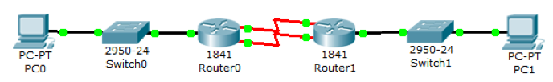
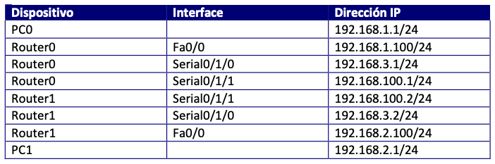
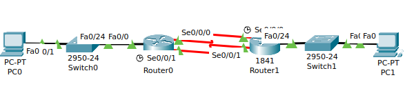
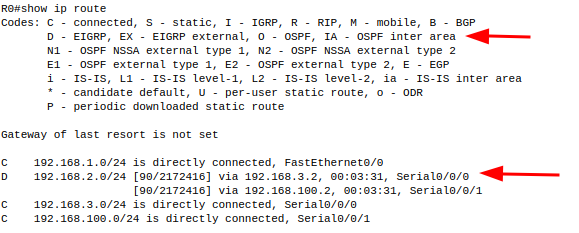
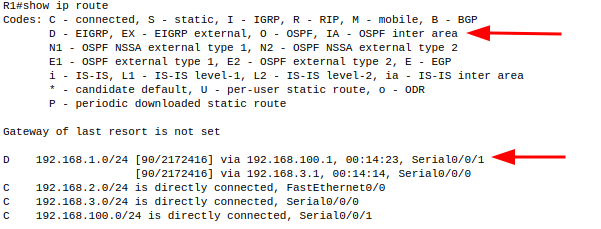
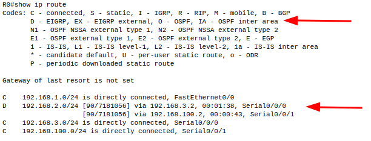
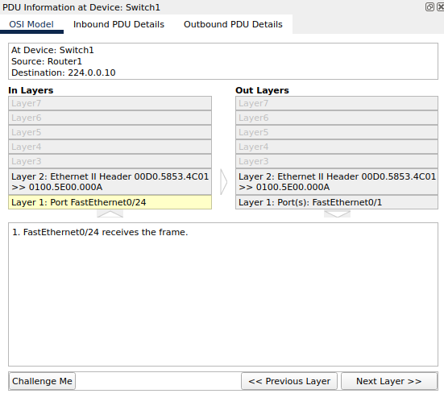

# ENRUTAMIENTO EIGRP  CON BALANCEO DE CARGA DE COSTOS DESIGUALES

José Gael Hernández García

Partiendo del siguiente esquema:

Y de la tabla de direccionamiento:

Vamos a conseguir realizar un balanceo de carga entre ambos enlaces cuando los costos de los enlaces son desiguales, ya que, cuando son iguales, el costo de los enlaces es el mismo, y la métrica definida también, por lo que, de forma automática, los routers se ponen a balancear carga por ambos enlaces.

1. Contruye la topología y asigna las direcciones  `IP` en base a la tabla.

2. Configura el protocolo **EIGRP** en los routers.

+ Router0

~~
R0(config)#router eigrp 101
R0(config-router)#network 192.168.1.0
R0(config-router)#network 192.168.3.0
R0(config-router)#network 192.168.100.0
~~

+ Router1

~~
R1(config)#router eigrp 101
R1(config-router)#network 192.168.100.0
R1(config-router)#
%DUAL-5-NBRCHANGE: IP-EIGRP 101: Neighbor 192.168.100.1 (Serial0/0/1) is up: new adjacency
R1(config-router)#network 192.168.3.0
R1(config-router)#
%DUAL-5-NBRCHANGE: IP-EIGRP 101: Neighbor 192.168.3.1 (Serial0/0/0) is up: new adjacency
R1(config-router)#network 192.168.2.0
~~

+ Comprueba que hay conectividad entre las redes extremas:

+ PC0-> PC1

~~
C:\>ping 192.168.2.1

Pinging 192.168.2.1 with 32 bytes of data:

Request timed out.
Reply from 192.168.2.1: bytes=32 time=1ms TTL=126
Reply from 192.168.2.1: bytes=32 time=1ms TTL=126
Reply from 192.168.2.1: bytes=32 time=2ms TTL=126

Ping statistics for 192.168.2.1:
    Packets: Sent = 4, Received = 3, Lost = 1 (25% loss),
Approximate round trip times in milli-seconds:
    Minimum = 1ms, Maximum = 2ms, Average = 1ms
~~

+ PC1-> PC0

~~
C:\>ping 192.168.1.1

Pinging 192.168.1.1 with 32 bytes of data:

Reply from 192.168.1.1: bytes=32 time=9ms TTL=126
Reply from 192.168.1.1: bytes=32 time=1ms TTL=126
Reply from 192.168.1.1: bytes=32 time=1ms TTL=126
Reply from 192.168.1.1: bytes=32 time=1ms TTL=126

Ping statistics for 192.168.1.1:
    Packets: Sent = 4, Received = 4, Lost = 0 (0% loss),
Approximate round trip times in milli-seconds:
    Minimum = 1ms, Maximum = 9ms, Average = 3ms
~~

3. Muestra la tabla de enrutamiento. Señala la existencia dos caminos posibles que tienen la misma distancia administrativa y el mismo coste. Por este motivo, el sistema no escoge por dónde enviar la información, sino que balancea carga de forma automática.

+ Router0

+ Router1

4. Cambia el ancho de banda de alguno de los dos enlaces, esto nos dará un diferente costo. Al hacerlo se pierde la conexión por un instante.

+ Router0

~~~
R0(config)#interface serial 0/0/0
R0(config-if)#bandwidth 384
R0(config-if)#
%DUAL-5-NBRCHANGE: IP-EIGRP 101: Neighbor 192.168.3.2 (Serial0/0/0) is down: interface down
%DUAL-5-NBRCHANGE: IP-EIGRP 101: Neighbor 192.168.3.2 (Serial0/0/0) is up: new adjacency
R0(config-if)#exit
R0(config)#interface serial 0/0/1
R0(config-if)#bandwidth 384
R0(config-if)#
%DUAL-5-NBRCHANGE: IP-EIGRP 101: Neighbor 192.168.100.2 (Serial0/0/1) is down: interface down
%DUAL-5-NBRCHANGE: IP-EIGRP 101: Neighbor 192.168.100.2 (Serial0/0/1) is up: new adjacency
~~~

5. Muestra la tabla de enrutamiento

+ Router0

Sólo aparece una de las dos conexiones. Lo solucionamos cambiando el parámetro de varianza, que es el parámetro que me permite utilizar valores de métrica que no sean exactamente iguales (la varianza mínima es 1 que es para que sean iguales, y la máxima varianza es 128), del grupo de EIGRP correspondiente:

~~~
R0(config)#router eigrp 101
R0(config-router)#variance 10
R0(config-router)#
%DUAL-5-NBRCHANGE: IP-EIGRP 101: Neighbor 192.168.100.2 (Serial0/0/1) is up: new adjacency
%DUAL-5-NBRCHANGE: IP-EIGRP 101: Neighbor 192.168.3.2 (Serial0/0/0) is up: new adjacency
~~~

No vamos a entrar en qué significa exactamente este parámetro. Sólo queremos ver que funciona. Para ello, veamos ahora la tabla en enrutamiento:

~~~
R0#show ip route
Codes: C - connected, S - static, I - IGRP, R - RIP, M - mobile, B - BGP
       D - EIGRP, EX - EIGRP external, O - OSPF, IA - OSPF inter area
       N1 - OSPF NSSA external type 1, N2 - OSPF NSSA external type 2
       E1 - OSPF external type 1, E2 - OSPF external type 2, E - EGP
       i - IS-IS, L1 - IS-IS level-1, L2 - IS-IS level-2, ia - IS-IS inter area
       * - candidate default, U - per-user static route, o - ODR
       P - periodic downloaded static route

Gateway of last resort is not set

C    192.168.1.0/24 is directly connected, FastEthernet0/0
D    192.168.2.0/24 [90/7181056] via 192.168.100.2, 00:00:35, Serial0/0/1
                    [90/7181056] via 192.168.3.2, 00:00:34, Serial0/0/0
C    192.168.3.0/24 is directly connected, Serial0/0/0
C    192.168.100.0/24 is directly connected, Serial0/0/1
~~~

Comprobamos que el paquete viaja desde el `PC0` al `PC1` a través de la interfaz `serial 0/0/0` debido a que se trata de una ruta más óptima.

